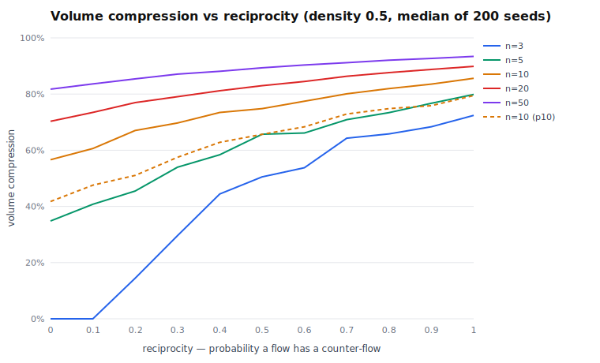
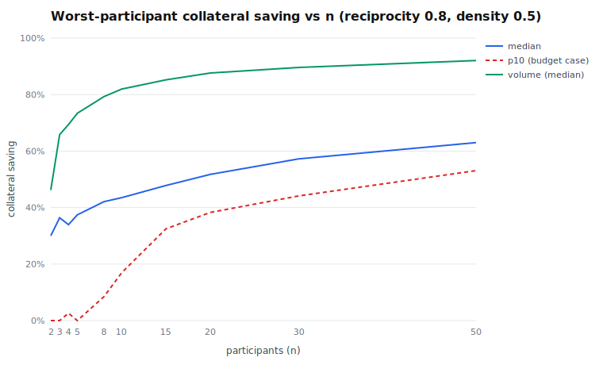

# ⚖️ arclear

**A multilateral obligation-netting clearinghouse primitive for [Arc](https://arc.network).**
100 micropayments, 1 settlement: agents exchange signed EIP-712 IOUs off-chain and
periodically settle only **net** positions from pre-posted collateral — atomically,
under unanimous consent, in a single transaction.

```
┌─────────────────────────────────────────────────────────┐
│                 ARCLEAR NETTING ROUND                   │
└─────────────────────────────────────────────────────────┘
  obligations netted     105 IOUs
  gross value            $55.19
  settled on-chain       $4.26
  capital compression    92.3%
  transactions           105 payments → 1 settlement tx
```

*(real output of `npm run e2e:anvil`; parameters and honest caveats in
[Measured compression](#measured-compression-when-is-netting-worth-it) below)*

## Why this exists

Circle Gateway's x402 batching compresses **transaction count**: many signed
authorizations, one `submitBatch`. It does not compress **value or float** —
every payment settles gross, and an agent must pre-fund its *gross* outflow
even when counterparties are paying it back all day. Two agents trading $500
of services in both directions each need ~$500 of idle float.

Netting fixes the other axis. Obligations accumulate off-chain as signed
IOUs (a tab, with a limit); a netting round cancels offsetting flows and
settles only residuals. Working capital drops from turnover-sized to
exposure-sized — the reason DTCC and CLS exist. And unlike the USDC-only
Gateway rail, a hub clears **any ERC-20**: deploy one for USDC, one for EURC.

|                        | Gateway batching | arclear netting |
| ---------------------- | ---------------- | --------------- |
| compresses             | transactions     | value + float   |
| pre-funding needed     | gross outflow    | net exposure    |
| credit between parties | none (prepay)    | bounded tab     |
| tokens                 | USDC only        | any ERC-20      |

They compose: net first, settle residuals over whatever rail you like.

## What's in the box

- **[`ClearingHub.sol`](contracts/src/ClearingHub.sol)** (~250 lines, Foundry) —
  collateral vault + atomic round settlement. Unanimous EIP-712 consent over a
  single shared digest of the full position set; strictly-ascending participant
  canonicalization; zero-sum enforcement; per-round manifest commitment; pause
  that can never trap funds. **26 tests: unit + revert matrix + 512-run fuzz +
  cross-stack digest parity.**
- **[`src/`](src/) — the TypeScript SDK** (viem-only): EIP-712 IOU + consent
  signing ([iou.ts](src/iou.ts), [round.ts](src/round.ts)), the deterministic
  netting engine ([netting.ts](src/netting.ts), spec in
  [PROTOCOL.md](docs/PROTOCOL.md)), bilateral credit caps
  ([creditCap.ts](src/creditCap.ts)), typed contract client
  ([client.ts](src/client.ts)). **16 property tests (fast-check): zero-sum,
  shuffle-determinism, dedup idempotence.**
- **[`demo/`](demo/)** — a 5-agent service economy (crawler → summarizer →
  oracle → trader → auditor) that signs ~100 IOUs and settles them in one
  round, on local anvil or Arc Testnet, with a zero-dependency live
  [dashboard](public/dashboard.html).
- **[`demo/sweep.ts`](demo/sweep.ts)** — the honesty machine: sweeps flow
  reciprocity, pair density, and participant count over 200 seeds per cell and
  reports median **and p10** compression (charts below, raw CSV in
  [docs/sweep](docs/sweep/sweep.csv)).

## Quickstart

```bash
git clone <this repo> && cd arclear
npm install
cd contracts && forge install && forge test && cd ..   # 26 tests
npm test                                               # 16 property tests
npm run e2e:anvil                                      # full flow, locally, ~20s
```

Live dashboard (spawns anvil, deploys, funds five agents):

```bash
npm run demo -- --anvil
# open http://localhost:4402 → "Simulate traffic" → "Run netting round"
```

Arc Testnet: copy `.env.example` → `.env`, set `ARC_RPC_URL`, `DEPLOYER_PK`
(fund it at [faucet.circle.com](https://faucet.circle.com/) — on Arc, USDC is
the native gas token with a 6-decimal ERC-20 facade at
`0x3600000000000000000000000000000000000000`, so one faucet drip covers both
gas and collateral), and `AGENT_MNEMONIC`. Then:

```bash
TOKEN_ADDRESS=0x3600000000000000000000000000000000000000 \
forge script contracts/script/Deploy.s.sol --root contracts \
  --rpc-url "$ARC_RPC_URL" --private-key "$DEPLOYER_PK" \
  --broadcast --with-gas-price 25gwei
# put the printed address into .env as HUB_USDC, then:
npm run e2e:testnet        # or: npm run demo (dashboard against testnet)
```

### Deployed hubs (Arc Testnet, chain 5042002)

**Arclear Net v1** (`ClearingHub` — unanimous consent; stays live):

| token | hub | status |
| ----- | --- | ------ |
| USDC `0x3600…0000` | [`0xd5A9ef69b47b0a3C8d326fDABd57aCaFA7D3d6e2`](https://testnet.arcscan.app/address/0xd5A9ef69b47b0a3C8d326fDABd57aCaFA7D3d6e2) | source verified ✓ |
| EURC `0x89B5…D72a` | [`0x867AD43f216B03c2a79eE02eC56F4bbEf90502c0`](https://testnet.arcscan.app/address/0x867AD43f216B03c2a79eE02eC56F4bbEf90502c0) | source verified ✓ |

Real settlement on the v1 USDC hub — 105 IOUs, $5.52 gross, $0.43 settled,
92.3% compression, one transaction:
[`0x64f3c5…a2c69`](https://testnet.arcscan.app/tx/0x64f3c58b0af6efcc622248550a7ca0dd963c35251c3f79b2fd237da89cfa2c69)

**Arclear Net v2** (`ClearingHubV2` — threshold consent: two-pass
exclude-and-recompute, execution path identical to v1; set these as
`HUB_V2_USDC` / `HUB_V2_EURC` in `.env`, v1 keys stay):

| token | hub | status |
| ----- | --- | ------ |
| USDC `0x3600…0000` | [`0xa984c64e1eA12B5aF5F573d58C3483fB8aB47f3c`](https://testnet.arcscan.app/address/0xa984c64e1eA12B5aF5F573d58C3483fB8aB47f3c) | source verified ✓ |
| EURC `0x89B5…D72a` | [`0x57A047599EaCDbe77Cc8C1A7978f88D700332Cb3`](https://testnet.arcscan.app/address/0x57A047599EaCDbe77Cc8C1A7978f88D700332Cb3) | source verified ✓ |

> Gas-token gotcha (documented so you don't rediscover it): USDC is Arc's
> native gas token *and* the ERC-20 at `0x3600…0000` — one balance, two
> views. Always set an explicit `gas` limit on writes; letting estimation
> probe with block-sized limits reserves your whole balance for gas and makes
> simulated token transfers revert with "transfer amount exceeds balance".

## Measured compression (when is netting worth it?)

One tuned demo number is marketing. So we swept the flow-shape space —
**reciprocity** (probability a flow A→B has a counter-flow B→A), **density**
(fraction of pairs that trade), and **n** (participants) — 200 seeds per
cell, reporting median *and* tenth-percentile (the round an operator budgets
for). Reproduce with `npm run sweep`.





Findings, including the ones that surprised us:

1. **Multilateral netting doesn't need bilateral reciprocity.** At n ≥ 5,
   median volume compression exceeds 30% even at reciprocity 0 — randomly
   directed flows form cancelable cycles on their own (A→B→C→A). Only tiny
   groups (n=3) need real reciprocity (≥ 0.4) to clear that bar.
2. **Aggregate volume compression mostly saturates by n ≈ 15–20** (85% at
   n=15 → 92% at n=50, density 0.5, reciprocity 0.8).
3. **But the operator-relevant number keeps climbing.** The *worst-placed*
   participant's collateral saving — median 37% at n=5 → 63% at n=50 — and
   crucially its p10: **≈ 0% for n ≤ 5**, 33% at n=15, 53% at n=50. In small
   pools, one round in ten leaves somebody saving nothing; large pools pay
   even their unluckiest member.
4. **Density barely matters** (66% → 87% compression across the whole 0.1–1.0
   range at n=10): netting is robust to sparse trading graphs.
5. The headline demo runs at n=5 with ring-shaped traffic (effective
   reciprocity ≈ 0.8), which is why it shows ~90%: it sits in the friendly
   region. Point 3 is the honest counterweight — and the design consequence
   below.

**Design consequence:** the value of netting concentrates in *larger* pools —
exactly where unanimous consent gets fragile. That makes threshold consent
(v2) the highest-value next step, ahead of any margin/default machinery: the
data says scale the pool before you underwrite it.

## Trust model (v1), honestly

- **Safety is on-chain and unconditional**: no balance moves without its
  owner's signature over the exact full position set. A malicious coordinator
  is structurally harmless — it holds no keys, every participant recomputes
  the netting before consenting (`verifyProposal`), and any tampering breaks
  the shared digest. Fuzz tests assert every perturbation reverts.
- **Liveness is bounded (v2)**: an unresponsive participant no longer stalls
  settlement — threshold consent excludes non-responders in one deterministic
  batch and rebuilds the round from the consenting subset (worst case two
  signature-collection passes: a latency cost, never a safety cost; spec in
  [PROTOCOL.md](docs/PROTOCOL.md)). Withdrawal is never pausable, and credit
  caps still bound a staller's paper.
- **Credit between rounds is a bounded bet**: the SDK's bilateral caps limit
  worst-case loss per counterparty to the cap you configured.
- No upgradeability, no fees, no owner access to funds.

Full checklist: [docs/THREAT-MODEL.md](docs/THREAT-MODEL.md). Protocol spec:
[docs/PROTOCOL.md](docs/PROTOCOL.md).

## Roadmap (v2)

In order, per the sweep data:

1. **Threshold consent** — ✅ shipped (`ClearingHubV2`, live on Arc Testnet
   above): non-signers are *excluded and recomputed*, never outvoted; the
   final set still signs unanimously, preserving consent-before-settlement.
2. **Merkle manifests** (same `bytes32` field, no contract change) →
   per-IOU inclusion/non-inclusion proofs → **on-chain IOU redemption**
   against a defaulter's collateral.
3. **Cross-currency rounds** — USDC and EURC legs settling atomically
   (payment-vs-payment, a miniature CLS on Arc).

## For Arc Open Source Showcase reviewers

**What primitives does this expose?** A forkable clearing layer: a ~250-line
collateral-and-settlement contract, a deterministic netting engine with a
published spec third parties can re-implement, EIP-712 IOU/consent schemas,
credit-cap tracking, and a reference coordinator + dashboard. Each piece is
importable on its own.

**What does it add beyond the `circlefin/arc-*` repos?** Those repos cover
*making* payments (commerce, p2p, x402 nanopayments, escrow, FX). None touch
clearing: nothing nets obligations, nothing compresses float, nothing gives
agents bounded credit. Gateway batching compresses transactions; arclear
compresses value — a complementary layer the reference stack doesn't have,
for USDC and EURC alike.

## License

[MIT](LICENSE)
