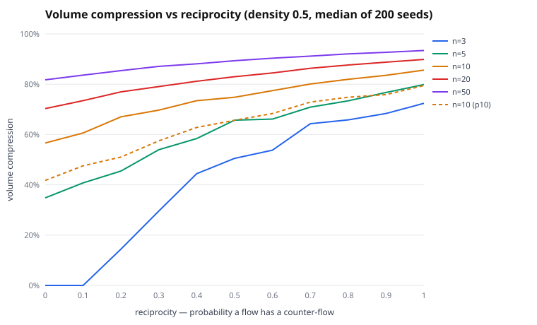
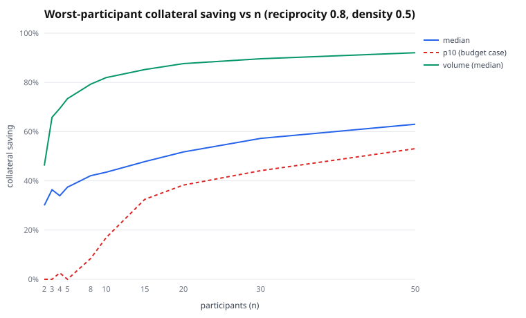

# ⚖️ arclear

**A permissionless multilateral obligation-netting clearinghouse primitive for
any ERC-20 on [Arc](https://arc.network).** 100 micropayments, 1 settlement:
parties accumulate signed EIP-712 IOUs off-chain (a tab, with a limit), then
settle only the **net** residual from pre-posted collateral — atomically, under
consent, in one transaction. It moves working capital from turnover-sized to
exposure-sized: the reason DTCC and CLS exist, as a ~250-line contract you
deploy.

```
┌─────────────────────────────────────────────────────────┐
│                 ARCLEAR NETTING ROUND                   │
└─────────────────────────────────────────────────────────┘
  obligations netted     105 IOUs
  gross value            $55.19
  settled on-chain       $4.26
  capital compression    92.3%
  transactions           105 payments → 1 settlement tx
```

*(real output of `npm run e2e:anvil`; parameters and honest caveats in
[Measured compression](#measured-compression-when-is-netting-worth-it) below)*

## Why this exists

Circle Gateway's x402 nanopayments compress **your outbound transaction count
and gas**: many signed authorizations, one bulk settlement, netting *your own*
outflows against your **prepaid** Gateway balance. What it does not do is
offset the flows coming back the other way — the money the same counterparties
owe *you* — or extend credit between parties. Each authorization is backed by
USDC you deposited, so your working capital stays sized to your outbound spend.
Two agents trading $500 of services in both directions each keep ~$500 funded.

Netting fixes that other axis. Obligations accumulate off-chain as signed IOUs
(a tab, with a limit); a round cancels offsetting *and cyclic* flows (A→B→C→A)
and settles only residuals from pre-posted collateral. Working capital drops
from turnover-sized to exposure-sized — the reason DTCC and CLS exist. And a
hub clears **any ERC-20**: deploy one for USDC, one for EURC. Netting
compresses obligations *within* a token; the `PvPRouter` composes two hubs
*across* tokens — USDC and EURC legs settling atomically in one transaction,
a miniature CLS.

|                        | Gateway / x402 nanopayments | arclear netting            |
| ---------------------- | --------------------------- | -------------------------- |
| compresses             | your outbound tx count + gas | reciprocal value + float   |
| netting scope          | one payer's own outflows    | full graph (bilateral + cyclic) |
| funding model          | prepaid balance ≥ your spend | collateral ≥ net exposure  |
| credit between parties | none (prepay)               | bounded tab                |
| tokens                 | USDC / Circle stablecoins   | any ERC-20                 |
| operator / custody     | Circle facilitator; non-custodial deposit, 7-day trustless exit | permissionless; no operator; withdraw never pausable |
| member default         | n/a (prepaid → no credit risk) | collateralized redemption (`redeemIOU`, best-effort) |

**They compose, they don't compete.** Net your mutual obligations through
Arclear, then settle the residual over whatever rail you like — including
Gateway. Gateway compresses transactions; Arclear compresses reciprocal float —
which is why Arclear carries a credit layer (bounded caps + a collateralized
recovery path) and Gateway doesn't need one.

## Capital model: collateral vs credit (two layers)

Arclear is **collateralized**. "Netting efficiency" means *post your net, not
your gross* — never *post nothing*.

**Layer 1 — on-chain collateral (posted upfront, real funds locked).** You
`deposit()` into the hub before you're a credible counterparty. A net debtor
whose collateral doesn't cover their net debit makes the round *revert*
(`InsufficientCollateral`). You size this to your **net** position, which
netting keeps far below your gross turnover.

**Layer 2 — off-chain inter-party credit (the tab, between settlements).**
When a creditor renders service and accepts a signed IOU instead of immediate
payment, they are *extending credit* — holding a promise, not cash. No token
moves. This is what lets obligations pile up and cancel. The creditor's
exposure in this window is bounded and backed four ways:

1. **Credit caps** cap the maximum loss to any one counterparty.
2. **Posted collateral backs the credit** — it's what makes your IOUs
   credible; more deposited → more credit others will extend you.
3. **`redeemIOU`** lets a creditor recover from a vanished debtor's collateral
   (best-effort; races the never-pausable `withdraw`).
4. **Round frequency** shrinks the credit window.

Worked example — A owes B $500, B owes A $300: net is A owes B **$200**. A
needs collateral ≥ **$200** (the net), not $500 (the gross); during the day B's
exposure to A is bounded by A's credit cap.

*(**Debtor** = the party that owes and signs the IOU; **creditor** = the party
that is owed. Canonical definitions in [PROTOCOL.md →
Roles](docs/PROTOCOL.md#roles); more vocabulary in
[docs/CONCEPTS.md](docs/CONCEPTS.md).)*

## Why use Arclear as a primitive

- **Capital efficiency by netting, not prepay.** Post collateral sized to your
  *net* position, not your *gross* turnover. Two agents trading $500 in both
  directions tie up ~$0 for the offsetting portion instead of ~$500 each.
- **Multilateral + cyclic cancellation.** Not just A↔B — obligation cycles
  (A→B→C→A) cancel on their own. The sweep shows >30% median volume
  compression at *zero* bilateral reciprocity for n ≥ 5.
- **Any ERC-20.** One hub per token (USDC, EURC, …). Not stablecoin-locked.
- **No trusted operator.** Depositing is joining. The coordinator holds no
  keys and cannot forge consent; every participant recomputes the netting
  before signing; the chain enforces zero-sum. Withdrawal is never pausable.
- **Bounded, backed credit.** Bilateral caps bound worst-case loss per
  counterparty; a debtor's posted collateral backs their IOUs; `redeemIOU`
  gives a collateralized recovery path if a member goes dark.
- **Composable.** Net through Arclear, settle the residual over whatever rail
  you like — including Gateway. Different compression axes; they stack.
- **Legible & tested.** Deterministic netting engine with a published spec
  third parties re-implement; TS↔Solidity digest parity; property + fuzz tests.

## What's in the box

- **[`ClearingHub.sol`](contracts/src/ClearingHub.sol)** (~250 lines, Foundry) —
  collateral vault + atomic round settlement. Unanimous EIP-712 consent over a
  single shared digest of the full position set; strictly-ascending participant
  canonicalization; zero-sum enforcement; per-round manifest commitment; pause
  that can never trap funds. **26 tests: unit + revert matrix + 512-run fuzz +
  cross-stack digest parity.**
- **IOU redemption (`ClearingHubV2`)** — the collateralized recovery path:
  when a debtor goes dark past K executed rounds, their creditor calls
  `redeemIOU` with the debtor's existing EIP-712 IOU signature plus merkle
  non-inclusion proofs against every buffered round root (rebuilt from
  public calldata — no coordinator trust) and recovers the amount straight
  from the debtor's posted collateral; a nullifier guarantees the redeemed
  IOU can never net again. Best-effort by design — it races the
  never-pausable `withdraw`; spec and honesty notes in
  [PROTOCOL.md](docs/PROTOCOL.md).
- **[`src/`](src/) — the TypeScript SDK** (viem-only): EIP-712 IOU + consent
  signing ([iou.ts](src/iou.ts), [round.ts](src/round.ts)), the deterministic
  netting engine ([netting.ts](src/netting.ts), spec in
  [PROTOCOL.md](docs/PROTOCOL.md)), bilateral credit caps
  ([creditCap.ts](src/creditCap.ts)), typed contract client
  ([client.ts](src/client.ts)). **16 property tests (fast-check): zero-sum,
  shuffle-determinism, dedup idempotence.**
- **[`demo/`](demo/)** — a 5-agent service economy (crawler → summarizer →
  oracle → trader → auditor) that signs ~100 IOUs and settles them in one
  round, on local anvil or Arc Testnet, with a zero-dependency live
  [dashboard](public/dashboard.html).
- **[`demo/sweep.ts`](demo/sweep.ts)** — the honesty machine: sweeps flow
  reciprocity, pair density, and participant count over 200 seeds per cell and
  reports median **and p10** compression (charts below, raw CSV in
  [docs/sweep](docs/sweep/sweep.csv)).

## Quickstart

**Integrating the SDK into your own project?** Start with the
[integrator quickstart](docs/QUICKSTART.md) — live hub addresses, the full
sign → net → consent → settle flow in runnable code, ~15 minutes.

```bash
git clone <this repo> && cd arclear
npm install
cd contracts && forge install && forge test && cd ..   # 26 tests
npm test                                               # 16 property tests
npm run e2e:anvil                                      # full flow, locally, ~20s
```

Live dashboard (spawns anvil, deploys, funds five agents):

```bash
npm run demo -- --anvil
# open http://localhost:4402 → "Simulate traffic" → "Run netting round"
```

Arc Testnet: copy `.env.example` → `.env`, set `ARC_RPC_URL`, `DEPLOYER_PK`
(fund it at [faucet.circle.com](https://faucet.circle.com/) — on Arc, USDC is
the native gas token with a 6-decimal ERC-20 facade at
`0x3600000000000000000000000000000000000000`, so one faucet drip covers both
gas and collateral), and `AGENT_MNEMONIC`. Then:

```bash
TOKEN_ADDRESS=0x3600000000000000000000000000000000000000 \
forge script contracts/script/Deploy.s.sol --root contracts \
  --rpc-url "$ARC_RPC_URL" --private-key "$DEPLOYER_PK" \
  --broadcast --with-gas-price 25gwei
# put the printed address into .env as HUB_USDC, then:
npm run e2e:testnet        # or: npm run demo (dashboard against testnet)
```

### Deployed hubs (Arc Testnet, chain 5042002)

**Arclear Net v1** (`ClearingHub` — unanimous consent; stays live):

| token | hub | status |
| ----- | --- | ------ |
| USDC `0x3600…0000` | [`0xd5A9ef69b47b0a3C8d326fDABd57aCaFA7D3d6e2`](https://testnet.arcscan.app/address/0xd5A9ef69b47b0a3C8d326fDABd57aCaFA7D3d6e2) | source verified ✓ |
| EURC `0x89B5…D72a` | [`0x867AD43f216B03c2a79eE02eC56F4bbEf90502c0`](https://testnet.arcscan.app/address/0x867AD43f216B03c2a79eE02eC56F4bbEf90502c0) | source verified ✓ |

Real settlement on the v1 USDC hub — 105 IOUs, $5.52 gross, $0.43 settled,
92.3% compression, one transaction:
[`0x64f3c5…a2c69`](https://testnet.arcscan.app/tx/0x64f3c58b0af6efcc622248550a7ca0dd963c35251c3f79b2fd237da89cfa2c69)

**Arclear Net v2 — current hubs** (`ClearingHubV2` — threshold consent +
merkle manifests + on-chain IOU redemption via `redeemIOU`; redemption
params K=3 / RING=16 / L=86,400 s are **uncalibrated** demo-scale defaults,
calibration deferred to the Phase 3 checkpoint; set these as `HUB_V2_USDC` /
`HUB_V2_EURC` in `.env`, v1 keys stay):

| token | hub | status |
| ----- | --- | ------ |
| USDC `0x3600…0000` | [`0x3b9a9617b91589a15A14122183e6305D9F0a5a16`](https://testnet.arcscan.app/address/0x3b9a9617b91589a15A14122183e6305D9F0a5a16) | source verified ✓ |
| EURC `0x89B5…D72a` | [`0xECcCD7E43B0Caf4D81420483dEE20E5e258FB85E`](https://testnet.arcscan.app/address/0xECcCD7E43B0Caf4D81420483dEE20E5e258FB85E) | source verified ✓ |

**Cross-currency PvP router** (`PvPRouter` — atomic USDC+EURC
payment-vs-payment rounds against the two current V2 hubs above, which it
pins as constructor immutables; stateless, holds no funds; set as
`PVP_ROUTER` in `.env`; spec in [PROTOCOL.md → Cross-currency PvP
rounds](docs/PROTOCOL.md#cross-currency-pvp-rounds)):

| contract | address | status |
| -------- | ------- | ------ |
| PvPRouter (hubUSDC `0x3b9a…5a16` · hubEURC `0xECcC…B85E`) | [`0x8287dD162e73f1a1DD15774dDc8A4137a2d3fE8c`](https://testnet.arcscan.app/address/0x8287dD162e73f1a1DD15774dDc8A4137a2d3fE8c) | source verified ✓ |

**Arclear Net v2 — Phase-1 hubs** (threshold consent only, no merkle
manifests or redemption; superseded by the hubs above but still live
on-chain):

| token | hub | status |
| ----- | --- | ------ |
| USDC `0x3600…0000` | [`0xa984c64e1eA12B5aF5F573d58C3483fB8aB47f3c`](https://testnet.arcscan.app/address/0xa984c64e1eA12B5aF5F573d58C3483fB8aB47f3c) | source verified ✓ · superseded |
| EURC `0x89B5…D72a` | [`0x57A047599EaCDbe77Cc8C1A7978f88D700332Cb3`](https://testnet.arcscan.app/address/0x57A047599EaCDbe77Cc8C1A7978f88D700332Cb3) | source verified ✓ · superseded |

> Gas-token gotcha (documented so you don't rediscover it): USDC is Arc's
> native gas token *and* the ERC-20 at `0x3600…0000` — one balance, two
> views. Always set an explicit `gas` limit on writes; letting estimation
> probe with block-sized limits reserves your whole balance for gas and makes
> simulated token transfers revert with "transfer amount exceeds balance".

## Use cases

**Where netting pays off:** a set of parties transacting repeatedly and
bidirectionally in one ERC-20, where reciprocal flows cancel. The more
mutual/cyclic the trade, the bigger the win.

| Use case | The bidirectional flow | Why netting wins |
|---|---|---|
| **Agent service mesh** | crawler→summarizer→oracle→trader→auditor→crawler | Cyclic flows cancel; agents fund net exposure, not gross API spend |
| **M2M / DePIN marketplaces** | nodes relay bandwidth/compute *for each other* | High reciprocity → high compression |
| **API / usage billing among vendors** | providers who also consume each other's APIs | Sub-cent metered billing needs near-zero settlement cost |
| **Intercompany treasury** | subsidiaries invoicing each other | On-chain intercompany netting — literally the DTCC/CLS model |
| **Trading desks / market makers** | counterparties with offsetting positions | Net-exposure settlement |
| **Game / app economies** | players transferring among a fixed pool | Thousands of transfers → one settlement, bounded per-player credit |
| **L2 / consortium fee-sharing** | sequencers/relayers splitting revenue mutually | Recurring bilateral obligations that net cleanly |

The honest counterweight — when netting is *not* worth it — is measured, not
asserted: see [Measured
compression](#measured-compression-when-is-netting-worth-it) below and the raw
sweep data in [docs/sweep](docs/sweep/sweep.csv).

**What already exists (and why this is still the gap):** Gateway/x402
(unidirectional, prepaid, USDC / Circle stablecoins); payment/state channels
(pairwise, per-channel capital lockup, routing + watchtower complexity);
rollups (compress gas, not float); streaming like Superfluid (gross
directional flows). Traditional netting (DTCC/CLS/ACH) is off-chain,
permissioned, and operator-trusted. Nothing occupies Arclear's spot:
**permissionless, multilateral, on-credit netting with a collateralized
recovery path, for any ERC-20, as a deployable contract.**

## Measured compression (when is netting worth it?)

One tuned demo number is marketing. So we swept the flow-shape space —
**reciprocity** (probability a flow A→B has a counter-flow B→A), **density**
(fraction of pairs that trade), and **n** (participants) — 200 seeds per
cell, reporting median *and* tenth-percentile (the round an operator budgets
for). Reproduce with `npm run sweep`.





Findings, including the ones that surprised us:

1. **Multilateral netting doesn't need bilateral reciprocity.** At n ≥ 5,
   median volume compression exceeds 30% even at reciprocity 0 — randomly
   directed flows form cancelable cycles on their own (A→B→C→A). Only tiny
   groups (n=3) need real reciprocity (≥ 0.4) to clear that bar.
2. **Aggregate volume compression mostly saturates by n ≈ 15–20** (85% at
   n=15 → 92% at n=50, density 0.5, reciprocity 0.8).
3. **But the operator-relevant number keeps climbing.** The *worst-placed*
   participant's collateral saving — median 37% at n=5 → 63% at n=50 — and
   crucially its p10: **≈ 0% for n ≤ 5**, 33% at n=15, 53% at n=50. In small
   pools, one round in ten leaves somebody saving nothing; large pools pay
   even their unluckiest member.
4. **Density barely matters** (66% → 87% compression across the whole 0.1–1.0
   range at n=10): netting is robust to sparse trading graphs.
5. The headline demo runs at n=5 with ring-shaped traffic (effective
   reciprocity ≈ 0.8), which is why it shows ~90%: it sits in the friendly
   region. Point 3 is the honest counterweight — and the design consequence
   below.

**Design consequence:** the value of netting concentrates in *larger* pools —
exactly where unanimous consent gets fragile. That makes threshold consent
(v2) the highest-value next step, ahead of any margin/default machinery: the
data says scale the pool before you underwrite it.

## Trust model (v1), honestly

- **Safety is on-chain and unconditional**: no balance moves without its
  owner's signature over the exact full position set. A malicious coordinator
  is structurally harmless — it holds no keys, every participant recomputes
  the netting before consenting (`verifyProposal`), and any tampering breaks
  the shared digest. Fuzz tests assert every perturbation reverts.
- **Liveness is bounded (v2)**: an unresponsive participant no longer stalls
  settlement — threshold consent excludes non-responders in one deterministic
  batch and rebuilds the round from the consenting subset (worst case two
  signature-collection passes: a latency cost, never a safety cost; spec in
  [PROTOCOL.md](docs/PROTOCOL.md)). Withdrawal is never pausable, and credit
  caps still bound a staller's paper.
- **Credit between rounds is a bounded bet**: the SDK's bilateral caps limit
  worst-case loss per counterparty to the cap you configured.
- No upgradeability, no fees, no owner access to funds.

Full checklist: [docs/THREAT-MODEL.md](docs/THREAT-MODEL.md). Protocol spec:
[docs/PROTOCOL.md](docs/PROTOCOL.md).

## Roadmap (v2)

In order, per the sweep data:

1. **Threshold consent** — ✅ shipped (`ClearingHubV2`, live on Arc Testnet
   above): non-signers are *excluded and recomputed*, never outvoted; the
   final set still signs unanimously, preserving consent-before-settlement.
2. **Merkle manifests + on-chain IOU redemption** — ✅ shipped
   (`ClearingHubV2`, current hubs above): sorted-leaf merkle manifest roots
   in the same `bytes32` field, per-IOU inclusion/non-inclusion proofs, and
   `redeemIOU` recovery against an unresponsive debtor's collateral
   (K/RING/L uncalibrated, labeled as such — calibration is the next
   checkpoint).
3. **Cross-currency rounds** — ✅ shipped (`PvPRouter`, live on Arc Testnet
   above): USDC and EURC legs settling atomically (payment-vs-payment, a
   miniature CLS on Arc), with the agreed per-round FX rate signed into the
   union's PvPRound consent digest.

## For Arc Open Source Showcase reviewers

**What primitives does this expose?** A forkable clearing layer: a ~250-line
collateral-and-settlement contract, a deterministic netting engine with a
published spec third parties can re-implement, EIP-712 IOU/consent schemas,
credit-cap tracking, and a reference coordinator + dashboard. Each piece is
importable on its own.

**What does it add beyond the `circlefin/arc-*` repos?** Those repos cover
*making* payments (commerce, p2p, x402 nanopayments, escrow, FX). None touch
clearing: nothing nets obligations, nothing compresses float, nothing gives
agents bounded credit. Gateway compresses your outbound transaction count;
arclear compresses reciprocal value and float across the full obligation
graph — a complementary layer the reference stack doesn't have, for USDC and
EURC alike. The [use-case table](#use-cases) above maps where that layer pays
off.

## License

[MIT](LICENSE)
