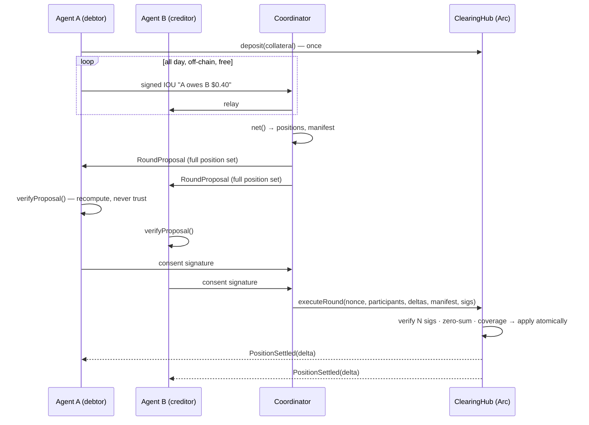

# Arclear protocol specification (v1)

Multilateral obligation netting for one ERC-20 on Arc. Participants exchange
signed off-chain IOUs, then periodically settle only **net** positions from
pre-posted collateral, in one atomic transaction, under **unanimous consent**.

## Roles

- **Participant** — an EOA that deposits collateral into a `ClearingHub` and
  signs IOUs (as debtor) and round consents. Depositing is joining; there is
  no registry.
- **Coordinator** — any process that relays IOUs, computes nettings, and
  assembles rounds. Holds **no keys and no authority**: it cannot forge
  consent, every participant re-derives the netting before signing, and
  `executeRound` is permissionless.
- **Hub** — one `ClearingHub` deployment per ERC-20 token. The EIP-712 domain
  binds signatures to a specific hub (and therefore token) and chain.

## Messages (EIP-712)

Shared domain — note the `verifyingContract` is the hub, which also binds the
token; `chainId` kills cross-chain replay:

```json
{ "name": "ArcClearingHub", "version": "1", "chainId": 5042002, "verifyingContract": "<hub>" }
```

### IOU

| field    | type    | meaning                                                       |
| -------- | ------- | ------------------------------------------------------------- |
| debtor   | address | who owes; must equal the recovered signer                     |
| creditor | address | who is owed; prevents re-targeting                            |
| amount   | uint256 | token base units (6 decimals for USDC/EURC)                   |
| nonce    | uint256 | monotonic per (debtor → creditor) pair; makes each IOU unique |
| expiry   | uint64  | unix seconds; expired IOUs are dropped by the engine          |
| ref      | bytes32 | opaque link to the business event (invoice id, x402 hash, …)  |

`iouId = hashTypedData(IOU)` — the same digest the debtor signs is the dedup
key and the manifest leaf.

### Round

| field        | type      | meaning                                                |
| ------------ | --------- | ------------------------------------------------------ |
| roundNonce   | uint64    | must equal the hub's `roundNonce`; replay guard        |
| participants | address[] | strictly ascending; canonical order                    |
| deltas       | int256[]  | index-aligned net positions; sum to exactly 0          |
| manifestHash | bytes32   | keccak256 of the sorted consumed-IOU-id list (see below) |

Every affected participant signs the **same digest** over the full arrays.
This is what makes unanimity meaningful: a coordinator cannot show different
data to different signers — any inconsistency produces mismatched digests and
signature recovery fails on-chain.

## Netting determinism spec

Third-party implementations must reproduce `src/netting.ts` exactly:

1. Dedup by `iouId` (case-insensitive hex compare).
2. Drop expired: `expiry <= now + safetyWindow` (default safety window 60 s).
3. Drop ids already consumed by an executed round.
4. Sum flows per participant: debtor −amount, creditor +amount. bigint only;
   **no division exists anywhere in the protocol**.
5. Sort participants ascending by lowercase hex address.
6. A participant stays in the round — possibly with delta 0 — iff at least
   one of their IOUs was consumed. Consent is what extinguishes paper, so a
   zero-net participant with consumed IOUs **must sign**. Addresses with no
   consumed IOUs never appear.
7. `consumedIds` sorted ascending; `manifestHash = keccak256(concat(ids))`,
   or `keccak256("0x")` for the empty list.

Output invariant: deltas sum to 0 (property-tested with fast-check; fuzz- and
invariant-tested in Foundry).

## Round lifecycle



State machine: `BUILDING → PROPOSED → CONSENTED → EXECUTED`, with `ABORTED`
from any pre-execution state (a refused consent or broken coverage aborts the
whole round; nothing partial can happen).

## Settlement semantics

`executeRound` checks, in order: round nonce; array lengths (≥ 2); strictly
ascending participants (canonical order + duplicate ban in one pass); one
valid signature per participant over the shared digest; deltas sum to zero;
then applies deltas — a net debtor's collateral must cover their debit or the
entire round reverts. Collateral conservation holds: netting moves balances
between participants inside the hub; the hub's token balance is untouched.

## Manifest commitment

v1 commits `keccak256` of the sorted consumed-id list — enough to *prove
after the fact* which paper a round extinguished (publish the list, anyone
recomputes the hash). It does not support efficient inclusion/non-inclusion
proofs; v2 swaps in a sorted-leaf merkle root (same `bytes32` field, no
contract change) to enable per-IOU proofs and an on-chain redemption path.

## Explicit non-goals in v1

- No individual IOU redemption on-chain (requires non-inclusion proofs).
- No threshold consent — one unresponsive participant stalls the round
  (liveness, never safety). See THREAT-MODEL.md.
- No cross-currency rounds (one hub = one token; deploy one hub per token).
- No fee-on-transfer token support.
