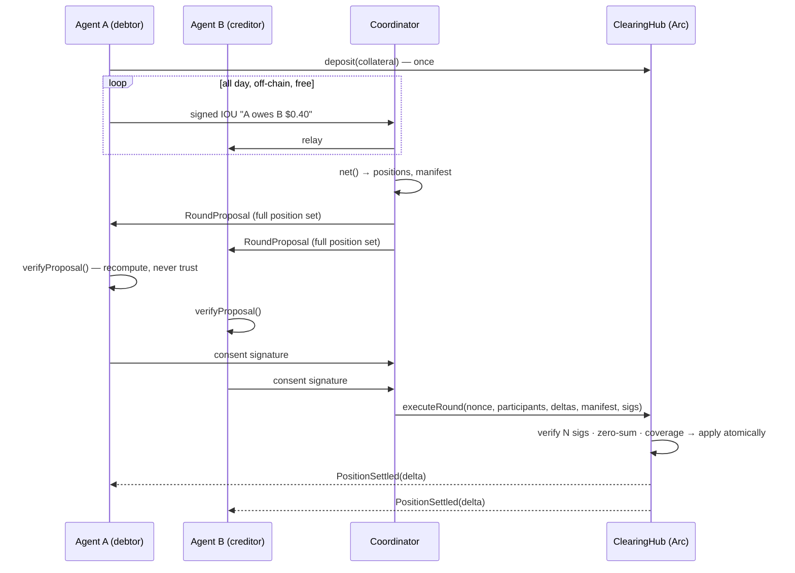

# Arclear protocol specification

Multilateral obligation netting for one ERC-20 on Arc. Participants exchange
signed off-chain IOUs, then periodically settle only **net** positions from
pre-posted collateral, in one atomic transaction, under **unanimous consent**
over the executed set. v2 adds **threshold consent** — a two-pass
exclude-and-recompute liveness path (see [Threshold
consent](#threshold-consent-v2-exclude-and-recompute)) — without changing the
signed structs, the digest, or the contract execution path.

## Roles

- **Participant** — an EOA that deposits collateral into a `ClearingHub` and
  signs IOUs (as debtor) and round consents. Depositing is joining; there is
  no registry.
- **Coordinator** — any process that relays IOUs, computes nettings, and
  assembles rounds. Holds **no keys and no authority**: it cannot forge
  consent, every participant re-derives the netting before signing, and
  `executeRound` is permissionless.
- **Hub** — one `ClearingHub` deployment per ERC-20 token. The EIP-712 domain
  binds signatures to a specific hub (and therefore token) and chain.

## Messages (EIP-712)

Shared domain — note the `verifyingContract` is the hub, which also binds the
token; `chainId` kills cross-chain replay:

```json
{ "name": "ArcClearingHub", "version": "1", "chainId": 5042002, "verifyingContract": "<hub>" }
```

### IOU

| field    | type    | meaning                                                       |
| -------- | ------- | ------------------------------------------------------------- |
| debtor   | address | who owes; must equal the recovered signer                     |
| creditor | address | who is owed; prevents re-targeting                            |
| amount   | uint256 | token base units (6 decimals for USDC/EURC)                   |
| nonce    | uint256 | monotonic per (debtor → creditor) pair; makes each IOU unique |
| expiry   | uint64  | unix seconds; expired IOUs are dropped by the engine          |
| ref      | bytes32 | opaque link to the business event (invoice id, x402 hash, …)  |

`iouId = hashTypedData(IOU)` — the same digest the debtor signs is the dedup
key and the manifest leaf.

### Round

| field        | type      | meaning                                                |
| ------------ | --------- | ------------------------------------------------------ |
| roundNonce   | uint64    | must equal the hub's `roundNonce`; replay guard        |
| participants | address[] | strictly ascending; canonical order                    |
| deltas       | int256[]  | index-aligned net positions; sum to exactly 0          |
| manifestHash | bytes32   | keccak256 of the sorted consumed-IOU-id list (see below) |

Every affected participant signs the **same digest** over the full arrays.
This is what makes unanimity meaningful: a coordinator cannot show different
data to different signers — any inconsistency produces mismatched digests and
signature recovery fails on-chain.

## Netting determinism spec

Third-party implementations must reproduce `src/netting.ts` exactly:

1. Dedup by `iouId` (case-insensitive hex compare).
2. Drop expired: `expiry <= now + safetyWindow` (default safety window 60 s).
3. Drop ids already consumed by an executed round.
4. Sum flows per participant: debtor −amount, creditor +amount. bigint only;
   **no division exists anywhere in the protocol**.
5. Sort participants ascending by lowercase hex address.
6. A participant stays in the round — possibly with delta 0 — iff at least
   one of their IOUs was consumed. Consent is what extinguishes paper, so a
   zero-net participant with consumed IOUs **must sign**. Addresses with no
   consumed IOUs never appear.
7. `consumedIds` sorted ascending; `manifestHash = keccak256(concat(ids))`,
   or `keccak256("0x")` for the empty list.

Output invariant: deltas sum to 0 (property-tested with fast-check; fuzz- and
invariant-tested in Foundry).

## Round lifecycle



State machine: `BUILDING → PROPOSED → CONSENTED → EXECUTED`, with `ABORTED`
from any pre-execution state (nothing partial can happen). In v1 a single
refused or missing consent aborted the whole round; under v2's threshold
consent (next section) a pass-1 stall or refusal instead triggers one bounded
rebuild pass before the abort path applies.

## Threshold consent (v2): exclude-and-recompute

One unresponsive participant must not stall settlement. v2 keeps unanimity
where it matters — over the **executed** set — and adds a bounded,
deterministic rebuild path around non-responders: **threshold over the
candidate set, unanimity over the final set. Never outvote — exclude and
recompute.** Third-party coordinators must reproduce these rules exactly:

1. **Propose over the candidate set.** Pass 1 proposes over everyone with
   open IOUs (the output of the netting spec above). Consents are collected
   within one wall-clock window. The deadline is out-of-band coordinator
   metadata — never part of the signed Round struct, so the digest, the
   fixtures, and the contract interface are unchanged from v1.
2. **One-batch exclusion.** When the window closes, all non-consenters —
   timeouts and reasoned refusals alike — are excluded **together in one
   deterministic batch**, snapshotted at the deadline. Consents arriving
   after the snapshot are ignored for this attempt.
3. **Rebuild = filter → re-net → re-propose, same `roundNonce`.** Drop every
   IOU touching an excluded member, re-run the netting spec on the remainder,
   and build the pass-2 proposal with the **same `roundNonce`** as pass 1
   (nothing executed, so the hub's nonce has not moved). Pass-1 signatures
   are never reusable for pass 2: deltas and manifest changed, so the digest
   changed.
4. **Unanimity over the final executed set.** Every member of the pass-2 set
   re-verifies locally — folding the excluded list into their own
   recomputation (filter, then re-net) — and re-signs the new digest. The
   contract still requires one valid signature per participant,
   index-matched; the threshold applies to the candidate set only, never to
   the executed set.
5. **Hard cap: two passes.** If anyone stalls or refuses during pass 2, the
   attempt aborts cleanly — nothing settles, no partial state, no third
   pass. The next round starts a fresh pass 1.
6. **Quorum floor: ≥ 2 participants.** A rebuilt round proceeds only if the
   recomputed netting still has at least two participants — the same floor
   the contract enforces (`TooFewParticipants`). Below it, clean abort.
7. **Miss semantics: refusal ≠ miss.** Only a **timeout** counts as a missed
   window. An explicit reasoned refusal (the member's local `verifyProposal`
   returned `{ ok: false }`) excludes them from this round but does **not**
   advance their miss counter — refusal is the safety mechanism working, not
   unresponsiveness. Miss counters are coordinator-local metadata with no
   in-protocol penalty in this phase.
8. **Unconditional re-inclusion.** Excluded members are always back in the
   candidate set for the next round — no backoff, no coordinator discretion.
   Their unexpired, unsettled IOUs simply carry over.

A cascade note on rule 3: filtering can remove more than the excluded
members. A pass-1 consenter whose only IOUs touched an excluded member drops
out of the pass-2 set entirely (netting rule 6: no consumed IOUs → not in the
round). Their paper stays open, no miss is counted, and they are simply not
asked to sign pass 2.

### Griefing analysis

What does it cost an attacker to grief the protocol by stalling, and what
does it cost the victims?

- **Cost of a stall: one extra collection pass.** Latency is bounded by
  2 × consent window + rebuild compute (a filter plus one re-run of the pure
  netting engine). Repeated stalling across rounds costs only repeated
  latency: re-inclusion is unconditional (rule 8) and miss counters carry no
  in-protocol penalty yet. The
  worst case is two signature-collection passes: a latency cost, never a safety cost.
- **Safety argument.** An excluded member's balance cannot move: they are
  absent from `participants`, and the contract requires N index-matched
  signatures over the shared digest — moving anyone's balance requires that
  person's signature over a set that includes them. A coordinator that lies
  about the excluded set produces delta mismatches that pass-2 verifiers
  refuse (each verifier folds the exclusion list into a local recomputation
  and compares). And if both passes somehow end up fully signed, each is
  individually unanimous — either would be safe to execute — while the
  shared `roundNonce` guarantees at most one ever does.
- **Coordinator censorship.** A coordinator can *pretend* any member timed
  out and exclude them at will. The cost to the victim is latency and lost
  netting compression only — never funds. The mitigation is unchanged from
  v1: the coordinator holds no keys and no authority, and anyone can run
  one.
- **Expiry interaction.** Exclusion consumes wall-clock time against IOU
  expiry: an IOU excluded in round n settles in round n+1 only if it is
  still unexpired then (netting rule 2's safety window applies at
  re-netting time). Choose expiries with rebuild latency in mind.

The framing to carry into the risk phases that follow:
in a payments CCP the defaulter's position is a scalar debit in a stable unit
— no volatile mark, no close-out auction. Threshold consent's job here is pure
liveness. It moves no risk, changes no math, and leaves the safety invariant
exactly where v1 put it — every settled balance movement was signed by its
owner over the exact executed position set.

## Settlement semantics

`executeRound` checks, in order: round nonce; array lengths (≥ 2); strictly
ascending participants (canonical order + duplicate ban in one pass); one
valid signature per participant over the shared digest; deltas sum to zero;
then applies deltas — a net debtor's collateral must cover their debit or the
entire round reverts. Collateral conservation holds: netting moves balances
between participants inside the hub; the hub's token balance is untouched.

## Manifest commitment

v1 commits `keccak256` of the sorted consumed-id list — enough to *prove
after the fact* which paper a round extinguished (publish the list, anyone
recomputes the hash). It does not support efficient inclusion/non-inclusion
proofs; v2 swaps in a sorted-leaf merkle root (same `bytes32` field, no
contract change) to enable per-IOU proofs and an on-chain redemption path.

## Explicit non-goals

- No individual IOU redemption on-chain (requires non-inclusion proofs; the
  merkle-manifest phase adds them).
- No cross-currency rounds (one hub = one token; deploy one hub per token).
- No fee-on-transfer token support.

> Superseded: v1 listed the absence of threshold consent as a non-goal — one
> unresponsive participant stalled the round. v2's exclude-and-recompute
> protocol (above) supersedes that: a stall is now a bounded latency cost,
> never a safety cost. See THREAT-MODEL.md for the updated griefing row.
