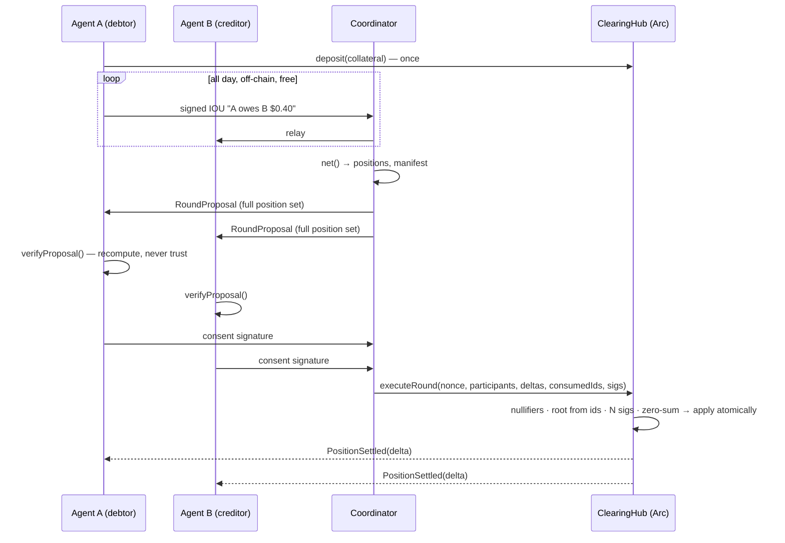

# Arclear protocol specification

Multilateral obligation netting for one ERC-20 on Arc. Participants exchange
signed off-chain IOUs, then periodically settle only **net** positions from
pre-posted collateral, in one atomic transaction, under **unanimous consent**
over the executed set. v2 adds **threshold consent** — a two-pass
exclude-and-recompute liveness path (see [Threshold
consent](#threshold-consent-v2-exclude-and-recompute)) — without changing the
signed structs, the digest, or the contract execution path. v2 also swaps the
manifest commitment to a **sorted-leaf merkle root** (same `bytes32` field,
same signed Round struct — see [Manifest commitment](#manifest-commitment))
and adds an on-chain **IOU redemption** recovery path against unresponsive
debtors (see [IOU redemption](#iou-redemption)): bilateral credit with a
collateralized recovery path.

## Roles

- **Participant** — an EOA that deposits collateral into a `ClearingHub` and
  signs IOUs (as debtor) and round consents. Depositing is joining; there is
  no registry.
- **Debtor / creditor** (canonical definitions — other docs link here, they do
  not redefine): **debtor** = the party that owes (consumed the service);
  **creditor** = the party that is owed (provided it). The **debtor signs the
  IOU** — the signature is them admitting the debt and authorizing that their
  collateral can be reduced by it. Roles are per-IOU: over a day an agent is
  debtor on what it consumed and creditor on what it provided; those
  flip-flopping positions are exactly what nets out.
- **Coordinator** — any process that relays IOUs, computes nettings, and
  assembles rounds. Holds **no keys and no authority**: it cannot forge
  consent, every participant re-derives the netting before signing, and
  `executeRound` is permissionless.
- **Hub** — one `ClearingHub` deployment per ERC-20 token. The EIP-712 domain
  binds signatures to a specific hub (and therefore token) and chain.

## Messages (EIP-712)

Shared domain — note the `verifyingContract` is the hub, which also binds the
token; `chainId` kills cross-chain replay:

```json
{ "name": "ArcClearingHub", "version": "1", "chainId": 5042002, "verifyingContract": "<hub>" }
```

### IOU

| field    | type    | meaning                                                       |
| -------- | ------- | ------------------------------------------------------------- |
| debtor   | address | who owes; must equal the recovered signer                     |
| creditor | address | who is owed; prevents re-targeting                            |
| amount   | uint256 | token base units (6 decimals for USDC/EURC)                   |
| nonce    | uint256 | monotonic per (debtor → creditor) pair; makes each IOU unique |
| expiry   | uint64  | unix seconds; expired IOUs are dropped by the engine          |
| ref      | bytes32 | opaque link to the business event (invoice id, x402 hash, …)  |

`iouId = hashTypedData(IOU)` — the same digest the debtor signs is the dedup
key and the manifest leaf.

### Round

| field        | type      | meaning                                                |
| ------------ | --------- | ------------------------------------------------------ |
| roundNonce   | uint64    | must equal the hub's `roundNonce`; replay guard        |
| participants | address[] | strictly ascending; canonical order                    |
| deltas       | int256[]  | index-aligned net positions; sum to exactly 0          |
| manifestHash | bytes32   | sorted-leaf merkle root of the consumed-id manifest (see below) |

Every affected participant signs the **same digest** over the full arrays.
This is what makes unanimity meaningful: a coordinator cannot show different
data to different signers — any inconsistency produces mismatched digests and
signature recovery fails on-chain.

## Netting determinism spec

Third-party implementations must reproduce `src/netting.ts` exactly:

1. Dedup by `iouId` (case-insensitive hex compare).
2. Drop expired: `expiry <= now + safetyWindow` (default safety window 60 s).
3. Drop ids already consumed by an executed round, and ids nullified by
   redemption — fold confirmed `IouRedeemed` chain logs; redeemed paper is
   extinguished and can never net again (see [IOU
   redemption](#iou-redemption)).
4. Sum flows per participant: debtor −amount, creditor +amount. bigint only;
   **no division exists anywhere in the protocol**.
5. Sort participants ascending by lowercase hex address.
6. A participant stays in the round — possibly with delta 0 — iff at least
   one of their IOUs was consumed. Consent is what extinguishes paper, so a
   zero-net participant with consumed IOUs **must sign**. Addresses with no
   consumed IOUs never appear.
7. `consumedIds` sorted ascending; `manifestHash` is the sorted-leaf merkle
   root over them per the construction rules in [Manifest
   commitment](#manifest-commitment), or the sentinel `keccak256("0x")` for
   the empty list. (v1 committed the plain `keccak256(concat(ids))`; the
   field and the signed Round struct are unchanged.)

Output invariant: deltas sum to 0 (property-tested with fast-check; fuzz- and
invariant-tested in Foundry).

## Round lifecycle


```mermaid
sequenceDiagram
    participant A as Agent A (debtor)
    participant B as Agent B (creditor)
    participant C as Coordinator
    participant H as ClearingHub (Arc)

    A->>H: deposit(collateral) — once
    loop all day, off-chain, free
        A->>C: signed IOU "A owes B $0.40"
        C->>B: relay
    end
    C->>C: net() → positions, manifest
    C->>A: RoundProposal (full position set)
    C->>B: RoundProposal (full position set)
    A->>A: verifyProposal() — recompute, never trust
    B->>B: verifyProposal()
    A->>C: consent signature
    B->>C: consent signature
    C->>H: executeRound(nonce, participants, deltas, consumedIds, sigs)
    H->>H: nullifiers · root from ids · N sigs · zero-sum → apply atomically
    H-->>A: PositionSettled(delta)
    H-->>B: PositionSettled(delta)
```

State machine: `BUILDING → PROPOSED → CONSENTED → EXECUTED`, with `ABORTED`
from any pre-execution state (nothing partial can happen). In v1 a single
refused or missing consent aborted the whole round; under v2's threshold
consent (next section) a pass-1 stall or refusal instead triggers one bounded
rebuild pass before the abort path applies.

## Threshold consent (v2): exclude-and-recompute

One unresponsive participant must not stall settlement. v2 keeps unanimity
where it matters — over the **executed** set — and adds a bounded,
deterministic rebuild path around non-responders: **threshold over the
candidate set, unanimity over the final set. Never outvote — exclude and
recompute.** Third-party coordinators must reproduce these rules exactly:

1. **Propose over the candidate set.** Pass 1 proposes over everyone with
   open IOUs (the output of the netting spec above). Consents are collected
   within one wall-clock window. The deadline is out-of-band coordinator
   metadata — never part of the signed Round struct, so the digest, the
   fixtures, and the contract interface are unchanged from v1.
2. **One-batch exclusion.** When the window closes, all non-consenters —
   timeouts and reasoned refusals alike — are excluded **together in one
   deterministic batch**, snapshotted at the deadline. Consents arriving
   after the snapshot are ignored for this attempt.
3. **Rebuild = filter → re-net → re-propose, same `roundNonce`.** Drop every
   IOU touching an excluded member, re-run the netting spec on the remainder,
   and build the pass-2 proposal with the **same `roundNonce`** as pass 1
   (nothing executed, so the hub's nonce has not moved). Pass-1 signatures
   are never reusable for pass 2: deltas and manifest changed, so the digest
   changed.
4. **Unanimity over the final executed set.** Every member of the pass-2 set
   re-verifies locally — folding the excluded list into their own
   recomputation (filter, then re-net) — and re-signs the new digest. The
   contract still requires one valid signature per participant,
   index-matched; the threshold applies to the candidate set only, never to
   the executed set.
5. **Hard cap: two passes.** If anyone stalls or refuses during pass 2, the
   attempt aborts cleanly — nothing settles, no partial state, no third
   pass. The next round starts a fresh pass 1.
6. **Quorum floor: ≥ 2 participants.** A rebuilt round proceeds only if the
   recomputed netting still has at least two participants — the same floor
   the contract enforces (`TooFewParticipants`). Below it, clean abort.
7. **Miss semantics: refusal ≠ miss.** Only a **timeout** counts as a missed
   window. An explicit reasoned refusal (the member's local `verifyProposal`
   returned `{ ok: false }`) excludes them from this round but does **not**
   advance their miss counter — refusal is the safety mechanism working, not
   unresponsiveness. Miss counters are coordinator-local metadata with no
   in-protocol penalty in this phase.
8. **Unconditional re-inclusion.** Excluded members are always back in the
   candidate set for the next round — no backoff, no coordinator discretion.
   Their unexpired, unsettled IOUs simply carry over.

A cascade note on rule 3: filtering can remove more than the excluded
members. A pass-1 consenter whose only IOUs touched an excluded member drops
out of the pass-2 set entirely (netting rule 6: no consumed IOUs → not in the
round). Their paper stays open, no miss is counted, and they are simply not
asked to sign pass 2.

### Griefing analysis

What does it cost an attacker to grief the protocol by stalling, and what
does it cost the victims?

- **Cost of a stall: one extra collection pass.** Latency is bounded by
  2 × consent window + rebuild compute (a filter plus one re-run of the pure
  netting engine). Repeated stalling across rounds costs only repeated
  latency: re-inclusion is unconditional (rule 8) and miss counters carry no
  in-protocol penalty yet. The
  worst case is two signature-collection passes: a latency cost, never a safety cost.
- **Safety argument.** An excluded member's balance cannot move: they are
  absent from `participants`, and the contract requires N index-matched
  signatures over the shared digest — moving anyone's balance requires that
  person's signature over a set that includes them. A coordinator that lies
  about the excluded set produces delta mismatches that pass-2 verifiers
  refuse (each verifier folds the exclusion list into a local recomputation
  and compares). And if both passes somehow end up fully signed, each is
  individually unanimous — either would be safe to execute — while the
  shared `roundNonce` guarantees at most one ever does.
- **Coordinator censorship.** A coordinator can *pretend* any member timed
  out and exclude them at will. The cost to the victim is latency and lost
  netting compression only — never funds. The mitigation is unchanged from
  v1: the coordinator holds no keys and no authority, and anyone can run
  one.
- **Expiry interaction.** Exclusion consumes wall-clock time against IOU
  expiry: an IOU excluded in round n settles in round n+1 only if it is
  still unexpired then (netting rule 2's safety window applies at
  re-netting time). Choose expiries with rebuild latency in mind.
- **Keep-alive censorship (v2 redemption).** The redemption staleness gate
  is a liveness heuristic, not an authorization boundary — and participation
  is cheap. A live debtor can ping-pong dust IOUs with an accomplice every
  round, keeping their `lastRound` fresh while refusing to ever net one
  specific creditor's paper: the redemption gate never opens for that
  creditor. This is a known, accepted limitation: the censorship is fully
  visible on-chain (the creditor's ids never appear in any manifest while
  the debtor stays active), it costs the debtor gas every single round, and
  punishing it is deliberately **out of protocol scope in the Net product**
  — no per-creditor participation tracking, no clever countermeasures.
  Credit caps remain the creditor's real defense: stop serving a debtor who
  plays this game.

The framing to carry into the risk phases that follow:
in a payments CCP the defaulter's position is a scalar debit in a stable unit
— no volatile mark, no close-out auction. Threshold consent's job here is pure
liveness. It moves no risk, changes no math, and leaves the safety invariant
exactly where v1 put it — every settled balance movement was signed by its
owner over the exact executed position set.

## Capital model (collateral vs credit)

Two layers, stated in one place (expanded treatment with worked examples in
the README "Capital model" section and `docs/CONCEPTS.md`):

- **Layer 1 — on-chain collateral (posted upfront, real funds locked).** A
  participant `deposit()`s before they are a credible counterparty. A net
  debtor whose collateral does not cover their net debit makes the round
  revert (`InsufficientCollateral`). Collateral is sized to the **net**
  position, which netting keeps far below gross turnover — "netting
  efficiency" means *post your net, not your gross*, never *post nothing*.
- **Layer 2 — off-chain inter-party credit (the tab, between settlements).**
  A creditor who accepts a signed IOU instead of immediate payment is
  *extending credit* — holding a promise, not cash; no token moves. The
  creditor's exposure in this window is bounded and backed four ways:
  bilateral credit caps (`src/creditCap.ts`) cap the maximum loss per
  counterparty; the debtor's posted collateral backs their paper (more
  deposited → more credit others will extend); `redeemIOU` gives a
  collateralized recovery path against a vanished debtor (best-effort — it
  races the never-pausable `withdraw`; see [IOU
  redemption](#iou-redemption)); and round frequency shrinks the credit
  window.

## Settlement semantics

`executeRound(nonce, participants, deltas, consumedIds, signatures)` — the v2
ABI carries the consumed-id list in calldata; the signed Round struct is
unchanged, and the manifest root is derived on-chain from `consumedIds`, so
signatures transitively bind the exact id list. It checks, in order: round
nonce; array lengths (≥ 2); **no consumed id is nullified**
(`NullifiedIdInManifest` — the on-chain half of redeem→cannot-net); manifest
root derivation (`ManifestMerkle.rootOf`, rejecting unsorted or duplicate
ids); strictly ascending participants (canonical order + duplicate ban in one
pass); one valid signature per participant over the shared digest; deltas sum
to zero; then applies deltas — a net debtor's collateral must cover their
debit or the entire round reverts. After settlement the hub writes
`lastRound[p] = nonce + 1` for **every** participant (zero-delta consenters
included: their netted paper was consumed, participation is consent) and
buffers the round's root in `rootRing[nonce % RING]` with its execution
timestamp — the state the redemption gate reads. Collateral conservation
holds: netting moves balances between participants inside the hub; the hub's
token balance is untouched.

## Manifest commitment

v1 committed `keccak256` of the sorted consumed-id list — enough to prove
after the fact which paper a round extinguished, but with no per-IOU proofs.
v2 commits a **sorted-leaf merkle root** in the same `bytes32` field of the
signed Round struct (no digest change — the existing digest fixtures prove
it), enabling per-IOU **inclusion** and **non-inclusion** proofs: the
foundation of the redemption path. `executeRound` receives the id list as
calldata and derives the root on-chain, so every round's leaf set is
permanently reconstructible from public transaction calldata — creditors
build proofs from chain data alone, trusting no coordinator.

### Construction rules

Third-party implementations (`src/merkle.ts` ↔
`contracts/src/lib/ManifestMerkle.sol` are two implementations of this one
spec, locked together by the shared fixture `test/fixtures/merkle.json`) must
reproduce these rules exactly:

1. **Leaves:** the consumed IOU ids, strictly ascending, unique, compared as
   lowercase hex — identical to numeric `bytes32` order and to the netting
   spec's rule-7 sort. Descending or duplicate input is rejected at build
   time (`UnsortedLeaves`).
2. **Leaf hash:** `L_i = keccak256(0x00 ‖ id_i)` — a single prefix byte,
   then the raw 32-byte id.
3. **Node hash:** `N = keccak256(0x01 ‖ left ‖ right)` — **ordered
   concatenation, never sorted**. Commutative sorted-pair hashing (the
   OpenZeppelin `MerkleProof` model) erases positional order and would make
   the bracketing non-inclusion proofs below meaningless.
4. **Level-up:** pair nodes `2j, 2j+1` into parent `j`; when a level has odd
   width, the lone last node **promotes upward unchanged** — no
   Bitcoin-style duplication, which creates ambiguous trees
   (CVE-2012-2459 class): `root([a,b,c]) != root([a,b,c,c])` is
   property-tested.
5. **Root:** the single remaining node. The **empty manifest** keeps the v1
   sentinel `keccak256("0x")` (Solidity: `keccak256("")`) — no tree is
   built, and empty-round behavior is unchanged from v1.

> **This is NOT an RFC 6962 tree.** Only RFC 6962's `0x00`/`0x01` prefix
> domain separation — the standard second-preimage defense, keeping leaf
> hashes and internal-node hashes in disjoint domains — is borrowed. The
> tree **shape** is level-wise pairing with lone-node promotion, *not* RFC
> 6962's largest-power-of-two split: a third party implementing the RFC's
> split rule will produce different roots for every non-power-of-two leaf
> count and diverge from this protocol. Under level-wise promotion the tree
> shape is uniquely determined by the leaf count — but note that the converse
> does **not** hold, and the position-binding argument below does not rest on
> it: a *verified* proof does not authenticate the `leafCount` it claims.

### Proof encodings

**Inclusion proof** — `(leaf, index, leafCount, siblings[])`: the raw IOU id
(pre-leaf-hash), its 0-based position in the sorted leaf list, the manifest's
total leaf count, and the sibling hashes bottom-up. Verification walk,
identical in both implementations:

1. Require `index < leafCount`; start with `h = keccak256(0x00 ‖ leaf)`,
   `i = index`, `w = leafCount`.
2. While `w > 1`: if `i` is odd, consume the next sibling as the **left**
   input (`h = keccak256(0x01 ‖ sibling ‖ h)`); else if `i != w − 1`,
   consume it as the **right** input (`h = keccak256(0x01 ‖ h ‖ sibling)`);
   else — lone last node — promote `h` unchanged, consuming **no** sibling.
   Then `i = i >> 1`, `w = (w + 1) >> 1`.
3. Accept iff **all** siblings were consumed (no extras) and `h == root`.

**Non-inclusion proof** — `(kind, a, b)` where `kind ∈ {BelowFirst,
AboveLast, Bracket}` and `a`/`b` are inclusion proofs. All comparisons are
**strict** inequalities, so an id equal to any proven leaf can never pass any
branch:

- **Sentinel short-circuit:** if `root == keccak256("0x")` the manifest is
  empty and every id is absent — no proof structure is inspected.
- **BelowFirst:** `a` verifies at `index == 0` and `id < a.leaf`.
- **AboveLast:** `a` verifies at `index == leafCount − 1` and `id > a.leaf`.
- **Bracket:** both `a` and `b` verify against the same root with
  `a.leafCount == b.leafCount` and `b.index == a.index + 1` (adjacent
  positions — skipping a leaf between them is structurally impossible), and
  `a.leaf < id < b.leaf`.
- A single-leaf tree (`leafCount == 1`, root = `keccak256(0x00 ‖ leaf)`) is
  covered by BelowFirst/AboveLast.

### Position-binding soundness

Why can a prover not lie about `index` or `leafCount` to fake a bracketing
claim (e.g. claim a non-last leaf is the last)? **Not** because `leafCount`
is bound by the root — it is not, and stating otherwise is the easy mistake
here. What verification binds is the sibling **consumption schedule**: the
sequence of levels at which a sibling is consumed and on which side. That
schedule is determined by `(index, leafCount)`, and reaching a genuine root
from a genuine leaf hash requires replaying that leaf's own schedule with
that leaf's own siblings — any lie that *changes* the schedule feeds
different byte strings into keccak and would need a keccak256 second
preimage.

But many `(index, leafCount)` pairs share one schedule, so a lie that
*preserves* it verifies. Enumerating every `(index, leafCount)` for leaf
counts up to 64 yields 127 distinct schedules, of which **123 are shared
across two or more different leaf counts** — e.g. a genuine 4-leaf root
verifies a proof claiming `leafCount = 3`, at index 0 (schedule `R,R`) and at
index 1 (schedule `L,R`) alike.

Non-inclusion is nevertheless sound, and this is where the real argument
lives — in the **kind-specific position checks**, not in `leafCount`:

- **BelowFirst** forces the claimed index to 0. The schedule of index 0 is a
  right-consumption at every level, and the only real leaf whose schedule is
  all right-consumptions is leaf 0 (any nonzero index has an odd bit at some
  level, which consumes on the left). So the anchor is genuinely the first
  leaf, and `id < a.leaf` really does place `id` below the whole manifest.
- **AboveLast** forces the claimed index to `leafCount − 1`. The last leaf is
  the last node at every level, so its schedule mixes only left-consumptions
  and promotions and **never** contains a right-consumption; conversely, once
  a walk is at a non-last index it stays non-last, so every non-last real
  leaf's schedule ends in a right-consumption at the final `w == 2` level.
  The two sets are disjoint, so no non-last leaf can be re-anchored as last.
- **Bracket** forces one shared claimed `leafCount` and consecutive claimed
  indices, which pins the two anchors to a genuinely adjacent pair.

Exhaustively enumerated: over all real manifests of n ≤ 64 leaves, against
claimed leaf counts up to 4096 (BelowFirst/AboveLast) and 256 (Bracket),
there are **zero** candidate forgeries of any kind — no member id can be made
to prove its own non-inclusion. The property is also adversarially
property-tested on both sides: random `index`/`leafCount` perturbations and
sibling tampering must be rejected (fast-check in `test/merkle.test.ts`,
512-run fuzz in `contracts/test/ClearingHubV2.t.sol`).

**Implementer's warning.** Because the argument rests on the position checks
and not on `leafCount`, a verified inclusion proof's `leafCount` is **not** an
authenticated manifest size — do not read it as one. Adding a new
`NonInclusionKind` re-opens this question from scratch: it must come with its
own disjointness argument over schedules, and the existing tests will not
catch its absence. If `leafCount` is ever needed as a trusted value, commit
it into the root (e.g. `root' = keccak256(0x02 ‖ root ‖ leafCount)`).

## IOU redemption

Redemption is what makes "a tab with a limit" honest: Arclear Net is
**bilateral credit with a collateralized recovery path**. When a debtor goes
dark, their creditor does not need the coordinator, the debtor, or anyone's
permission — they take the IOU the debtor already signed, prove on-chain that
it was never settled, and recover the amount directly from the debtor's
posted collateral.

The parameters — `K` (staleness, default 3), `RING` (root-buffer depth,
default 16), `L = MAX_IOU_LIFETIME` (default 86,400 s) — are **UNCALIBRATED**
demo-scale placeholders; calibrating them against real round cadence is
explicitly deferred to the Phase 3 calibration checkpoint. They are labeled
as such on the contract's immutables and in the deploy script.

### The redemption gate

`redeemIOU(iou, sig, proofs[])` is permissionless (a relayer can submit —
funds only ever credit the IOU's named creditor) and checks these rules **in
order**; third-party implementations must reproduce them exactly:

1. **Trivia:** `amount != 0` (`ZeroAmount`); `debtor != creditor`
   (`SelfIou`).
2. **Staleness — on-chain criterion:** the debtor must be **absent from the
   last ≥ K executed rounds**: with `lastRound` 1-based (`nonce + 1` written
   for every participant of an executed round; 0 = never participated), the
   gate is `roundNonce ≥ lastRound[debtor] + K`, else revert
   (`DebtorNotStale`). A never-participated debtor is stale once
   `roundNonce ≥ K` — they have ignored every executed round that ever
   existed. **The coordinator's wall-clock miss counters are an off-chain
   early-warning signal only** and are never consulted on-chain: aborted
   rounds and idle periods advance no on-chain clock, so the two views can
   disagree — the executed-rounds criterion is the authoritative gate.
3. **Coverage:** either the full history is still buffered
   (`roundNonce ≤ RING` — nothing ever evicted), or the oldest buffered
   round executed strictly before `expiry − L`
   (`executedAt(oldest) < expiry − L`), else revert
   (`CoverageWindowNotBuffered`). See the safety argument below.
4. **Debtor signature:** `ECDSA.recover(hashIou(iou), sig) == debtor`
   (`BadIouSignature`). `hashIou` is the same EIP-712 digest as the SDK's
   `iouId` — the signature the debtor produced when issuing the IOU is
   reused; no new signed struct exists.
5. **Nullifier:** `!redeemed[id]` where `id = hashIou(iou)`
   (`AlreadyRedeemed`).
6. **Non-inclusion proofs — contract-derived, exact count:** exactly one
   non-inclusion proof per buffered round, positionally matched to ascending
   round nonces. **The contract derives the required set itself** from its
   own `roundNonce` and `RING` — proofs are answers to the contract's
   question, never the prover's choice, so omitting the one root that
   contains the IOU is structurally impossible (`ProofCountMismatch` /
   `NonInclusionProofInvalid`). Sentinel (empty-manifest) roots pass
   structurally. This also closes the TOCTOU race: if a round executes
   between proof generation and the redemption transaction being mined,
   `roundNonce` has moved, the count/positional match fails, and the call
   reverts — the creditor simply regenerates proofs from calldata and
   resubmits. No round is ever silently uncovered.
7. **Effects:** set `redeemed[id] = true`; debit the debtor's collateral by
   the **full** amount or revert (`InsufficientCollateral`) — **no partial
   redemption**, the nullifier is boolean; credit the creditor; emit
   `IouRedeemed`. The hub's token balance is untouched — collateral
   conservation, exactly as in rounds.

**Expiry semantics:** redemption is valid **before and after** expiry —
expiry bounds *netting*, not recovery (there is deliberately no
`block.timestamp < expiry` check). Post-expiry is the calmer case: the
consumption set is frozen. The redemption window closes *structurally* when
the ring buffer rolls past `expiry − L` (coverage rule 3), not on a clock.

### Coverage safety argument (the L-convention)

The hazard: an IOU netted in round *r* could be double-claimed once *r*'s
root is evicted from the ring — every remaining non-inclusion proof would
pass honestly. The rule that prevents it needs no new signed field:

- **Signing convention:** the SDK's `signIou` enforces
  `expiry ≤ signTime + L`. An IOU can only be consumed in a round its debtor
  signed (netting rule 6 plus `executeRound`'s unanimous signatures), and an
  honest participant's netting drops IOUs with `expiry ≤ now + safetyWindow`
  — so every round that consumed the IOU executed inside `[expiry − L,
  expiry)`. *Assumption:* the 60 s netting safety window covers
  proposal-to-execution latency, so no round consumes an IOU at or after its
  expiry.
- **Therefore:** when `executedAt(oldest buffered) < expiry − L`, every
  round that could possibly have consumed the IOU is still buffered, and the
  full proof set is complete — **net → cannot-redeem holds unconditionally
  for any IOU signed under the convention**.
- **Incentive-safe against violation:** only the debtor signs IOUs, and
  double-claiming only debits the debtor — a debtor who signs
  `expiry > signTime + L` weakens *only their own* double-claim protection.
  A creditor cannot manufacture a long-lived IOU, and third parties are
  untouched (redemption moves collateral strictly debtor → creditor).
- **Fail-closed:** if rounds execute so fast that the buffer spans less than
  `L` of wall-clock time, the coverage condition can never hold and
  redemption narrows to unavailability — a **liveness loss, never a safety
  loss**. Likewise `expiry ≤ L` with evicted history reverts (the would-be
  underflow branch is guarded). This K/RING/L/cadence trade-off is exactly
  the calibration question deferred to Phase 3.

### Exclusivity, both directions

Netting and redemption are mutually exclusive per IOU, enforced on-chain in
both directions (and invariant-tested on real chain state):

- **Redeem → cannot-net:** `executeRound` reverts (`NullifiedIdInManifest`)
  if any consumed id is nullified. Coordinators additionally converge
  off-chain by folding confirmed `IouRedeemed` logs into their netting
  exclusions — the on-chain check is the backstop, not the primary filter.
- **Net → cannot-redeem:** a consumed id is a leaf of some buffered root, so
  its non-inclusion proof against that root cannot exist; the coverage rule
  guarantees the containing round is still buffered for honest debtors.

### Honest limitations

- **Redemption races exit — best-effort by design.** `withdraw` is never
  pausable (a v1 invariant that must not change: the exit guarantee is the
  product's spine). A debtor can withdraw free collateral at any moment,
  including between a creditor's proof generation and the redemption
  transaction landing. Redemption therefore recovers **posted,
  still-present collateral only** — it is a race against exit and makes no
  recovery guarantee. Bilateral credit caps (`src/creditCap.ts`) remain the
  actual exposure bound; redemption is the recovery path for what is still
  there, not insurance.
- **Keep-alive censorship is possible** — see the griefing analysis
  addition below: a live debtor can keep the staleness gate closed while
  censoring one creditor. Visible on-chain, costs gas every round, and
  deliberately out of protocol scope to punish in the Net product.
- **`redeemIOU` is pausable** (circuit-breaker parity with `executeRound` —
  redemption is a settlement operation). The exit guarantee lives solely in
  `withdraw`, which no pause ever touches.

### Measured gas (n = 5, fresh state, uncalibrated defaults)

Measured on the shipped contract via `gasleft()` deltas with all storage
cold — the worst case client gas limits must cover, not warm steady-state:

| Operation | Config | Measured gas |
| --------- | ------ | ------------ |
| `executeRound` | m = 10 consumed ids | 329,108 |
| `executeRound` | m = 105 (demo scale) | 691,708 |
| `executeRound` | m = 250 | 1,254,993 |
| `redeemIOU` | RING = 16 full, 8-id manifests (16 proofs, depth 3) | 199,604 |
| `executePvP` | two legs, n = 3+3, m = 10+10, union 4 | 563,814 |
| `executePvP` | two legs, n = 5+5, m = 105+105 (demo scale), union 5 | 1,734,897 |

Marginal cost ≈ 3,885 gas per consumed id (mildly superlinear from memory
expansion). The SDK sets explicit size-parameterized limits with ≥ 1.5×
margin (`gas = 300,000 + 40,000·n + 6,000·m`; `redeemIOU` flat 500,000;
`executePvP` composes the leg formula twice plus a measured router term:
`350,000 + 2·300,000 + 40,000·(n₁+n₂) + 6,000·(m₁+m₂) + 15,000·n_union`) —
explicit gas is mandatory on Arc, where estimation reserves the whole USDC
balance. Snapshot persisted in `contracts/.gas-snapshot` (snapshot lines
record full-test gas including setup; the table above records the call-only
`gasleft()` deltas the client formulas are fitted against). For scale: the
live anvil e2e PvP bundle (4+4 IOUs, warm collateral slots) measures
~507,442 gas.

## Cross-currency PvP rounds

One hub clears one token. Cross-currency settlement composes two hubs: a
stateless `PvPRouter` (`contracts/src/PvPRouter.sol`) executes a USDC leg and
a EURC leg — each an **ordinary netting round on its own hub**, built with the
netting spec and Round struct above, unchanged — inside **one** transaction.
Both legs settle or neither does: payment-vs-payment, a miniature CLS on Arc.
The deployed hubs are untouched and unaware of the router; `executePvP` is
permissionless, and the router holds no funds, no owner, no pause switch, and
no storage beyond two immutable hub addresses.

### PvPRound (EIP-712)

The router is its own EIP-712 verifying contract:

```json
{ "name": "ArclearPvPRouter", "version": "1", "chainId": 5042002, "verifyingContract": "<router>" }
```

Typehash (verbatim — `src/pvp.ts` and `PvPRouter.sol` must byte-match; the
shared digest fixture locks them together):

```
PvPRound(bytes32 usdcLegDigest,bytes32 eurcLegDigest,uint256 fxNumerator,uint256 fxDenominator)
```

| field | type | meaning |
| ----- | ---- | ------- |
| usdcLegDigest | bytes32 | the USDC leg's hub Round digest (`hubUSDC.hashRound`) |
| eurcLegDigest | bytes32 | the EURC leg's hub Round digest (`hubEURC.hashRound`) |
| fxNumerator | uint256 | EURC base units of the agreed rate pair; never zero |
| fxDenominator | uint256 | USDC base units of the agreed rate pair; never zero |

Every member of the **sorted union** of the two legs' participant sets signs
this digest — exactly one signature per union member, index-aligned to the
merged ascending order. The union is a superset of everyone whose signed leg
delta assumed the other leg settles at this rate, so union-signing is sound
for any set relationship: overlapping, disjoint, or identical participant
sets are all normal (a member appears in a leg iff their IOUs were consumed
there — netting rule 6 applies per hub). Signing the PvPRound moves no
balance by itself: balance movement still requires that member's ordinary
leg consent on the leg containing them, which the hubs verify unchanged.

### Atomicity argument

`executePvP` checks, in order: rate sanity (`ZeroRate`); calldata-vs-signed
leg binding — each leg's digest is recomputed via that hub's **public,
parity-locked `hashRound`** over the calldata leg (manifest root derived by
`ManifestMerkle.rootOf`, never reimplemented in the router) and must equal
the digest the union signed (`LegDigestMismatch`), so the PvPRound signature
transitively binds the exact calldata being executed; union consent
(`UnionNotStrictlyAscending`, `PvPSignatureCountMismatch`,
`BadPvPSignature`); then it executes both legs as **plain high-level
external calls** — no try/catch, no low-level calls, by construction.
Revert bubbling is the mechanism: a revert in either leg (bad signature,
wrong nonce, insufficient collateral, paused hub, nullified id, …) bubbles
up and reverts the whole transaction, so neither leg ever settles alone
*through the router*. Catching a leg failure is the only way the router
itself could break both-or-neither, which is why no such wrapper exists.

The hub pair is pinned as **constructor immutables** — hub addresses never
come from calldata. Because `verifyingContract` is the router and a router
deployment is permanently bound to one hub pair, a PvPRound signature is
consent to legs on exactly those two hubs; substituting a malicious hub is
structurally closed. The router needs no replay state either: each signed
leg digest binds its hub's `roundNonce`, so once either leg executes (by any
path) the bundle can never execute again.

The both-or-neither guarantee holds within the router path and against every
failure/revert mode. It does **not** hold against an adversary who obtains
and unilaterally submits one leg's full signature set — leg consents are
ordinary hub Round signatures, valid standalone, and `executeRound` is
permissionless. That residual is stated plainly, with its harm bound, in
THREAT-MODEL.md (single-leg extraction).

### Rate semantics

The agreed rate is a base-unit amount pair, never a decimal and never a
quotient: `fxNumerator` = EURC base units, `fxDenominator` = USDC base
units. A cross-currency trade pairing `u` USDC-leg base units with `e`
EURC-leg base units is rate-consistent iff

```
e * fxDenominator == u * fxNumerator
```

— pure bigint cross-multiplication; no division exists anywhere in the
protocol, and both tokens are 6-decimal on Arc so there is no decimal-skew
term. An FX trade is a *pair* of IOUs — one on each hub, opposite directions
between the same two parties — sharing the same `ref`; verifiers
(`verifyPvPProposal`) pair by `ref` and check cross-multiplication **per
pair**, plus **inclusion symmetry**: both sides of a pair must be jointly
consumed or jointly deferred by the two proposed legs, so a coordinator can
never settle one side of a member's trade while stripping the counter-IOU
from the other leg (THREAT-MODEL row 27). The rate check is explicitly NOT
applicable to net deltas: a round
mixes FX flows with ordinary same-currency flows, so
`usdcDelta·fxDen == −eurcDelta·fxNum` does not hold in general and must not
be asserted, on-chain or off. The router verifies signatures, never
economics — off-chain compute, on-chain enforce.

### arc-stablecoin-fx tie-in

The per-round rate is agreed in the same amount-pair form the official
`circlefin/arc-stablecoin-fx` sample's App Kit swap quotes use (`amountIn`
with an `estimatedOutput` amount — e.g. 1 USDC → 0.989589 EURC becomes
`fxNumerator = 989_589`, `fxDenominator = 1_000_000`). A production
coordinator would source the pair from an App Kit `estimateSwap` quote; the
sample itself is a Next.js/Supabase app not consumable from a
dependency-free viem SDK, so the demo **mirrors the sample's quote data
shape** as its rate source — this shape-mirror is the sanctioned D-06
fallback, documented here as such. The rate is *agreed, not oracle-derived*:
unanimous consent over the PvPRound digest is what bounds rate manipulation
— everyone whose delta depends on it signed it.

### Standing consent (no deadline, by design)

The PvPRound has no deadline field, deliberately. The legs — not the wrapper
— are the replayable objects: a fully-signed bundle at hub nonces that never
advance remains executable indefinitely, exactly the base protocol's
documented standing-consent property for leg consents. A PvPRound-level
deadline would give false comfort while binding nothing the hubs check.
Either hub's nonce advancing (by any round) permanently invalidates the
bundle.

## Explicit non-goals

- No cross-currency rounds (one hub = one token; deploy one hub per token).
- No fee-on-transfer token support.

> Superseded: v1 listed the absence of threshold consent as a non-goal — one
> unresponsive participant stalled the round. v2's exclude-and-recompute
> protocol (above) supersedes that: a stall is now a bounded latency cost,
> never a safety cost. See THREAT-MODEL.md for the updated griefing row.

> Superseded: v1 also listed individual IOU redemption as a non-goal — it
> required non-inclusion proofs that did not exist. v2's merkle manifests
> add them, and the [IOU redemption](#iou-redemption) section above
> supersedes that: an unresponsive debtor's signed paper is now recoverable
> on-chain against their posted collateral — best-effort by design (it
> races the never-pausable `withdraw`), gated by on-chain staleness and the
> L-bounded coverage rule, with uncalibrated K/RING/L labeled as such. See
> THREAT-MODEL.md for the redemption rows.

> Superseded: "no cross-currency rounds" held — and still holds — at the
> hub level: one hub clears exactly one token, and no hub was changed. The
> [Cross-currency PvP rounds](#cross-currency-pvp-rounds) section above
> supersedes it at the composition layer: a stateless `PvPRouter` settles a
> USDC leg and a EURC leg atomically in one transaction under union-signed
> PvPRound consent, with the agreed FX rate bound into the digest and the
> single-leg-extraction residual stated plainly. See THREAT-MODEL.md for
> the PvP rows.
