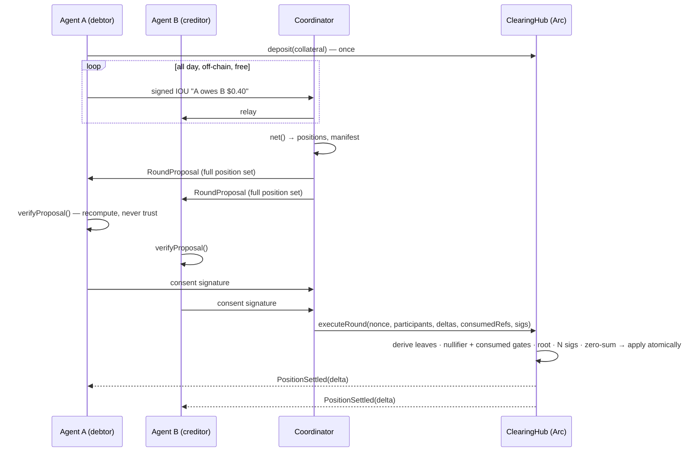

# Arclear protocol specification

Multilateral obligation netting for one ERC-20 on Arc. Participants exchange
signed off-chain IOUs, then periodically settle only **net** positions from
pre-posted collateral, in one atomic transaction, under **unanimous consent**
over the executed set. v2 adds **threshold consent** — a two-pass
exclude-and-recompute liveness path (see [Threshold
consent](#threshold-consent-v2-exclude-and-recompute)) — without changing the
signed structs, the digest, or the contract execution path. v2 also swaps the
manifest commitment to a **sorted-leaf merkle root** (same `bytes32` field,
same signed Round struct — see [Manifest commitment](#manifest-commitment))
and adds an on-chain **IOU redemption** recovery path against unresponsive
debtors (see [IOU redemption](#iou-redemption)): bilateral credit with a
collateralized recovery path.

**This document specifies `ClearingHubV3`, the current hubs.** A full-repo
audit on 2026-07-27 found two redeploy-class flaws in V2's redemption path, and
V3 is the redesign that closes them. In one paragraph, because it changes how
you read every section below:

- **Manifest leaves are party-bound.** A manifest entry is no longer a bare
  IOU id but `leafId = keccak256(id ‖ lo ‖ hi)`, where `(lo, hi)` is the IOU's
  debtor/creditor pair sorted ascending. Consuming real paper therefore
  requires **both parties to be signing participants** of the round — and in
  particular requires the **creditor's** signature, which is what makes writing
  somebody else's id into a manifest economically inert.
- **Consumption is a permanent on-chain ledger.** `executeRound` writes
  `consumed[leafId] = true`; `redeemIOU` refuses exactly when that bit is set.
  This deletes the root ring, the non-inclusion proof set, the `expiry − L`
  coverage precondition, and the `MAX_IOU_LIFETIME` (`L`) immutable outright.
  Redemption is now **O(1) and history-independent**: its guarantee cannot be
  eroded by anything a third party does.

What did **not** change: the EIP-712 domain (`"ArcClearingHub"`, `"1"`), the
`Round` and `IOU` structs, `hashRound`, `hashIou`, zero-sum, strictly-ascending
participants, unanimity over the executed set, the never-pausable `withdraw`,
and the merkle construction rules. The digest fixtures still pass byte-for-byte
— only the *preimage* of `manifestHash` changed.

What V3 cost: **more gas per round** (a consumed entry now pays a cold SSTORE),
bought back with a redemption path 3.5× cheaper and no longer growing with
history. Both sides are measured in [Measured gas](#measured-gas). The full
before/after, including what remains live on the V2 hubs, is in [What V3 fixed,
and what is still live on the V2 hubs](#what-v3-fixed-and-what-is-still-live-on-the-v2-hubs).

## Roles

- **Participant** — an EOA that deposits collateral into a `ClearingHub` and
  signs IOUs (as debtor) and round consents. Depositing is joining; there is
  no registry.
- **Debtor / creditor** (canonical definitions — other docs link here, they do
  not redefine): **debtor** = the party that owes (consumed the service);
  **creditor** = the party that is owed (provided it). The **debtor signs the
  IOU** — the signature is them admitting the debt and authorizing that their
  collateral can be reduced by it. Roles are per-IOU: over a day an agent is
  debtor on what it consumed and creditor on what it provided; those
  flip-flopping positions are exactly what nets out.
- **Coordinator** — any process that relays IOUs, computes nettings, and
  assembles rounds. Holds **no keys and no authority**: it cannot forge
  consent, every participant re-derives the netting before signing, and
  `executeRound` is permissionless.
- **Hub** — one `ClearingHubV3` deployment per ERC-20 token. The EIP-712 domain
  binds signatures to a specific hub (and therefore token) and chain.

## Messages (EIP-712)

Shared domain — note the `verifyingContract` is the hub, which also binds the
token; `chainId` kills cross-chain replay:

```json
{ "name": "ArcClearingHub", "version": "1", "chainId": 5042002, "verifyingContract": "<hub>" }
```

### IOU

| field    | type    | meaning                                                       |
| -------- | ------- | ------------------------------------------------------------- |
| debtor   | address | who owes; must equal the recovered signer                     |
| creditor | address | who is owed; prevents re-targeting                            |
| amount   | uint256 | token base units (6 decimals for USDC/EURC)                   |
| nonce    | uint256 | monotonic per (debtor → creditor) pair; makes each IOU unique |
| expiry   | uint64  | unix seconds; expired IOUs are dropped by the engine          |
| ref      | bytes32 | opaque link to the business event (invoice id, x402 hash, …)  |

`iouId = hashTypedData(IOU)` — the same digest the debtor signs is the dedup
key, the key of the hub's redemption nullifier, and the **first preimage
component** of the manifest leaf (v3: the leaf itself additionally binds the
party pair — see [Manifest commitment](#manifest-commitment)).

### Round

| field        | type      | meaning                                                |
| ------------ | --------- | ------------------------------------------------------ |
| roundNonce   | uint64    | must equal the hub's `roundNonce`; replay guard        |
| participants | address[] | strictly ascending; canonical order                    |
| deltas       | int256[]  | index-aligned net positions; sum to exactly 0          |
| manifestHash | bytes32   | sorted-leaf merkle root over the **party-bound leaves** of the consumed set (see below) |

Every affected participant signs the **same digest** over the full arrays.
This is what makes unanimity meaningful: a coordinator cannot show different
data to different signers — any inconsistency produces mismatched digests and
signature recovery fails on-chain.

## Netting determinism spec

Third-party implementations must reproduce `src/netting.ts` exactly:

0. **Ids are derived, never read from the input.** Each IOU's id is recomputed
   as `iouId(hub, iou)` from the signed struct; a caller-supplied
   `SignedIou.id` carries no authority and is ignored. (`net()` exposes an
   explicit `unsafeTrustProvidedIds` escape hatch for synthetic simulation
   pools whose "ids" are not EIP-712 digests at all — never for signed paper.)
1. Dedup by `iouId` (case-insensitive hex compare).
2. Drop expired: `expiry <= now + safetyWindow` (default safety window 60 s).
3. Drop ids already consumed by an executed round, and ids nullified by
   redemption — fold confirmed `IouRedeemed` chain logs; redeemed paper is
   extinguished and can never net again (see [IOU
   redemption](#iou-redemption)). Both exclusion sets are keyed by **raw id**,
   not by leaf: the hub's `redeemed` nullifier is raw-id-keyed, and `id →
   leafId` is a function (the id is `hashIou`, which already fixes both
   parties), so raw-id bookkeeping is equivalent and strictly more
   conservative.
4. Sum flows per participant: debtor −amount, creditor +amount. bigint only;
   **no division exists anywhere in the protocol**.
5. Sort participants ascending by lowercase hex address.
6. A participant stays in the round — possibly with delta 0 — iff at least
   one of their IOUs was consumed. Consent is what extinguishes paper, so a
   zero-net participant with consumed IOUs **must sign**. Addresses with no
   consumed IOUs never appear. This rule is also what makes every consumed
   IOU's parties indexable into the round's `participants` array (v3).
7. The consumed set is sorted ascending **by derived leaf**
   `manifestLeafId(id, debtor, creditor)` — **not** by raw id, which is what
   v1/v2 sorted by. That is the order `ManifestMerkle.rootOf` sees on-chain.
   `manifestHash` is the sorted-leaf merkle root over those leaves per the
   construction rules in [Manifest commitment](#manifest-commitment), or the
   sentinel `keccak256("0x")` for the empty set. (v1 committed the plain
   `keccak256(concat(ids))`; the field and the signed Round struct are
   unchanged across all three versions.)

Output invariant: deltas sum to 0 (property-tested with fast-check; fuzz- and
invariant-tested in Foundry).

Each entry of the consumed set carries `{ id, debtor, creditor, leafId }`
(`ConsumedIou` in `src/types.ts`). Every one of those fields is **derived**:
consumers recompute them from the IOU and compare, never adopt. The
calldata-shaped `ConsumedRef { id, partyAIdx, partyBIdx }` is produced from a
`ConsumedIou[]` at submission time by `consumedRefs(participants, consumed)`;
indices are meaningless without their participant array, so the party-bearing
form is the transportable one.

## Round lifecycle


```mermaid
sequenceDiagram
    participant A as Agent A (debtor)
    participant B as Agent B (creditor)
    participant C as Coordinator
    participant H as ClearingHub (Arc)

    A->>H: deposit(collateral) — once
    loop all day, off-chain, free
        A->>C: signed IOU "A owes B $0.40"
        C->>B: relay
    end
    C->>C: net() → positions, manifest
    C->>A: RoundProposal (full position set)
    C->>B: RoundProposal (full position set)
    A->>A: verifyProposal() — recompute, never trust
    B->>B: verifyProposal()
    A->>C: consent signature
    B->>C: consent signature
    C->>H: executeRound(nonce, participants, deltas, consumedRefs, sigs)
    H->>H: derive leaves · nullifier + consumed gates · root · N sigs · zero-sum → apply atomically
    H-->>A: PositionSettled(delta)
    H-->>B: PositionSettled(delta)
```

State machine: `BUILDING → PROPOSED → CONSENTED → EXECUTED`, with `ABORTED`
from any pre-execution state (nothing partial can happen). In v1 a single
refused or missing consent aborted the whole round; under v2's threshold
consent (next section) a pass-1 stall or refusal instead triggers one bounded
rebuild pass before the abort path applies.

## Threshold consent (v2): exclude-and-recompute

One unresponsive participant must not stall settlement. v2 keeps unanimity
where it matters — over the **executed** set — and adds a bounded,
deterministic rebuild path around non-responders: **threshold over the
candidate set, unanimity over the final set. Never outvote — exclude and
recompute.** Third-party coordinators must reproduce these rules exactly:

1. **Propose over the candidate set.** Pass 1 proposes over everyone with
   open IOUs (the output of the netting spec above). Consents are collected
   within one wall-clock window. The deadline is out-of-band coordinator
   metadata — never part of the signed Round struct, so the digest, the
   fixtures, and the contract interface are unchanged from v1.
2. **One-batch exclusion.** When the window closes, all non-consenters —
   timeouts and reasoned refusals alike — are excluded **together in one
   deterministic batch**, snapshotted at the deadline. Consents arriving
   after the snapshot are ignored for this attempt.
3. **Rebuild = filter → re-net → re-propose, same `roundNonce`.** Drop every
   IOU touching an excluded member, re-run the netting spec on the remainder,
   and build the pass-2 proposal with the **same `roundNonce`** as pass 1
   (nothing executed, so the hub's nonce has not moved). Pass-1 signatures
   are never reusable for pass 2: deltas and manifest changed, so the digest
   changed.
4. **Unanimity over the final executed set.** Every member of the pass-2 set
   re-verifies locally — folding the excluded list into their own
   recomputation (filter, then re-net) — and re-signs the new digest. The
   contract still requires one valid signature per participant,
   index-matched; the threshold applies to the candidate set only, never to
   the executed set.
5. **Hard cap: two passes.** If anyone stalls or refuses during pass 2, the
   attempt aborts cleanly — nothing settles, no partial state, no third
   pass. The next round starts a fresh pass 1.
6. **Quorum floor: ≥ 2 participants.** A rebuilt round proceeds only if the
   recomputed netting still has at least two participants — the same floor
   the contract enforces (`TooFewParticipants`). Below it, clean abort.
7. **Miss semantics: refusal ≠ miss.** Only a **timeout** counts as a missed
   window. An explicit reasoned refusal (the member's local `verifyProposal`
   returned `{ ok: false }`) excludes them from this round but does **not**
   advance their miss counter — refusal is the safety mechanism working, not
   unresponsiveness. Miss counters are coordinator-local metadata with no
   in-protocol penalty in this phase.
8. **Unconditional re-inclusion.** Excluded members are always back in the
   candidate set for the next round — no backoff, no coordinator discretion.
   Their unexpired, unsettled IOUs simply carry over.

A cascade note on rule 3: filtering can remove more than the excluded
members. A pass-1 consenter whose only IOUs touched an excluded member drops
out of the pass-2 set entirely (netting rule 6: no consumed IOUs → not in the
round). Their paper stays open, no miss is counted, and they are simply not
asked to sign pass 2.

### Griefing analysis

What does it cost an attacker to grief the protocol by stalling, and what
does it cost the victims?

- **Cost of a stall: one extra collection pass.** Latency is bounded by
  2 × consent window + rebuild compute (a filter plus one re-run of the pure
  netting engine). Repeated stalling across rounds costs only repeated
  latency: re-inclusion is unconditional (rule 8) and miss counters carry no
  in-protocol penalty yet. The
  worst case is two signature-collection passes: a latency cost, never a safety cost.
- **Safety argument.** An excluded member's balance cannot move: they are
  absent from `participants`, and the contract requires N index-matched
  signatures over the shared digest — moving anyone's balance requires that
  person's signature over a set that includes them. A coordinator that lies
  about the excluded set produces delta mismatches that pass-2 verifiers
  refuse (each verifier folds the exclusion list into a local recomputation
  and compares). And if both passes somehow end up fully signed, each is
  individually unanimous — either would be safe to execute — while the
  shared `roundNonce` guarantees at most one ever does.
- **Coordinator censorship.** A coordinator can *pretend* any member timed
  out and exclude them at will. The cost to the victim is latency and lost
  netting compression only — never funds. The mitigation is unchanged from
  v1: the coordinator holds no keys and no authority, and anyone can run
  one.
- **Expiry interaction.** Exclusion consumes wall-clock time against IOU
  expiry: an IOU excluded in round n settles in round n+1 only if it is
  still unexpired then (netting rule 2's safety window applies at
  re-netting time). Choose expiries with rebuild latency in mind.
- **Keep-alive censorship (redemption).** The redemption staleness gate
  is a liveness heuristic, not an authorization boundary — and participation
  is cheap. A live debtor can ping-pong dust IOUs with an accomplice every
  round, keeping their `lastRound` fresh while refusing to ever net one
  specific creditor's paper: the redemption gate never opens for that
  creditor. This is a known, accepted limitation: the censorship is fully
  visible on-chain (the creditor's leaves never appear in any manifest while
  the debtor stays active), it costs the debtor gas every single round, and
  punishing it is deliberately **out of protocol scope in the Net product**
  — no per-creditor participation tracking, no clever countermeasures.
  Credit caps remain the creditor's real defense: stop serving a debtor who
  plays this game.

  Two v3 notes. **The on-chain visibility signal is now honest**: under v2 the
  debtor could have written the creditor's id into a manifest themselves,
  forging the appearance of settlement — CR-01 closed that, and a leaf naming
  the creditor now requires the creditor's own signature. But **the keep-alive
  itself is not closed**: WR-11 raised its price from "co-sign anything" to a
  cold SSTORE per fabricated ref, and the contract cannot distinguish
  fabricated paper from real. The mirror-image move — a third party paying for
  rounds to accelerate *everyone else's* staleness — is equally inherent to a
  round-counted clock. Neither moves collateral without the affected party's
  signature.

The framing to carry into the risk phases that follow:
in a payments CCP the defaulter's position is a scalar debit in a stable unit
— no volatile mark, no close-out auction. Threshold consent's job here is pure
liveness. It moves no risk, changes no math, and leaves the safety invariant
exactly where v1 put it — every settled balance movement was signed by its
owner over the exact executed position set.

## Capital model (collateral vs credit)

Two layers, stated in one place (expanded treatment with worked examples in
the README "Capital model" section and `docs/CONCEPTS.md`):

- **Layer 1 — on-chain collateral (posted upfront, real funds locked).** A
  participant `deposit()`s before they are a credible counterparty. A net
  debtor whose collateral does not cover their net debit makes the round
  revert (`InsufficientCollateral`). Collateral is sized to the **net**
  position, which netting keeps far below gross turnover — "netting
  efficiency" means *post your net, not your gross*, never *post nothing*.
- **Layer 2 — off-chain inter-party credit (the tab, between settlements).**
  A creditor who accepts a signed IOU instead of immediate payment is
  *extending credit* — holding a promise, not cash; no token moves. The
  creditor's exposure in this window is bounded and backed four ways:
  bilateral credit caps (`src/creditCap.ts`) cap the maximum loss per
  counterparty; the debtor's posted collateral backs their paper (more
  deposited → more credit others will extend); `redeemIOU` gives a
  collateralized recovery path against a vanished debtor (best-effort — it
  races the never-pausable `withdraw`; see [IOU
  redemption](#iou-redemption)); and round frequency shrinks the credit
  window.

## Settlement semantics

`executeRound(nonce, participants, deltas, consumed, signatures)` — the v3 ABI
carries a **party-bound** `ConsumedRef[]` in calldata (`{ bytes32 id, uint32
partyAIdx, uint32 partyBIdx }`, the two indices pointing into this round's
`participants`); the signed Round struct is unchanged, and the manifest root is
still derived on-chain, so signatures transitively bind the exact leaf set —
including each entry's party attribution. It checks, in order:

1. **Round nonce** equals the hub's `roundNonce` (`WrongRoundNonce`).
2. **Array lengths**: `n ≥ 2` (`TooFewParticipants`), `deltas.length ==
   signatures.length == n` (`LengthMismatch`).
3. **Non-empty effect**: a round with an empty manifest **and** an all-zero
   delta vector is rejected (`EmptyRound`). Such a round achieves nothing
   except advancing `roundNonce`, which moves every non-participant closer to
   being redeemable-against. An all-zero delta vector *with* a non-empty
   manifest stays legal — a round in which everyone's flows cancel exactly is
   the ideal netting outcome, and blocking it would leave genuinely-cancelled
   paper redeemable. The scan runs only when the manifest is empty, so honest
   rounds never pay for it.
4. **Per-ref structural gates**, one pass: both party indices in range
   (`PartyIndexOutOfRange`), the two distinct (`SelfConsumedRef`), the id not
   already redeemed (`NullifiedIdInManifest` — the on-chain half of
   redeem→cannot-net), and the derived leaf not already consumed by an earlier
   round (`AlreadyConsumed`). The leaf is
   `manifestLeafId(id, participants[a], participants[b])`.
5. **Manifest root derivation** (`ManifestMerkle.rootOf`) over those derived
   leaves, rejecting a set that is not strictly ascending by leaf
   (`UnsortedLeaves` — which also makes duplicates within one manifest
   impossible).
6. **Strictly ascending participants** (canonical order + duplicate ban in one
   pass) and **one valid signature per participant** over the shared digest.
7. **Zero-sum** (`DeltasDoNotSumToZero`).
8. **Effects**: write `consumed[leaf] = true` for every ref, then apply deltas
   — a net debtor's collateral must cover their debit or the entire round
   reverts (`InsufficientCollateral`).

After settlement the hub writes `lastRound[p] = nonce + 1` **only for
participants who actually settled something** — a non-zero delta, or a
`ConsumedRef` naming them as a party. Co-signing alone no longer refreshes the
liveness marker (audit WR-11): under V2 an address could keep its clock fresh
by rubber-stamping rounds it had no stake in. The delta disjunct matters — a
round may legitimately move value with an empty manifest, and those
participants must not be recorded as idle. `lastRound` therefore reads as
"the last round this address **settled in**", not "co-signed".

There is no root ring and no execution timestamp: the permanent `consumed`
ledger written in step 8 *is* the state the redemption gate reads. Collateral
conservation holds: netting moves balances between participants inside the hub;
the hub's token balance is untouched.

**New on-chain invariant: one IOU, one settlement.** `AlreadyConsumed` makes
this a property of the contract. Under V2 the same id could appear in unlimited
round manifests and "don't re-net settled paper" was a coordinator convention
backed only by off-chain `settledIds` bookkeeping (audit IN-05).

## Manifest commitment

v1 committed `keccak256` of the sorted consumed-id list — enough to prove
after the fact which paper a round extinguished, but with no per-IOU proofs.
v2 commits a **sorted-leaf merkle root** in the same `bytes32` field of the
signed Round struct (no digest change — the existing digest fixtures prove
it). `executeRound` receives the manifest as calldata and derives the root
on-chain, so every round's leaf set is permanently reconstructible from public
transaction calldata, trusting no coordinator.

**v3 keeps the commitment and changes what a leaf is.** The commitment is not
what was broken; the redemption *proof mechanism* built on it was. `rootOf`
still derives `manifestHash` on-chain and it still travels into the signed
`Round` digest, so signatures bind the exact leaf set. What changed is the
leaf.

### The party-bound leaf (v3)

```
manifestLeafId(id, partyA, partyB) = keccak256(id ‖ lo ‖ hi)
    where (lo, hi) = (partyA, partyB) sorted ascending by address
```

Three fixed-width operands (32 + 20 + 20 bytes), so the packed encoding is
unambiguous and no packing collision exists. Implemented three times and
parity-locked: `ClearingHubV3.manifestLeafId`, `PvPRouterV3.manifestLeafId`
(a deliberate local mirror — an external staticcall per leaf would cost more
than the whole merkle pass), and `src/merkle.ts`'s `manifestLeafId`, asserted
byte-equal from the shared fixture `test/fixtures/merkle.json` (unit + fuzz).

**Why the pair is sorted rather than role-ordered.** Which party is the debtor
is already fixed inside `id` — `hashIou` covers both addresses — so ordering
loses no binding. Sorting removes a role-swap footgun: a coordinator that
supplied debtor and creditor the other way round would otherwise commit a leaf
that the creditor's later redemption check never reads, leaving a
genuinely-netted IOU still redeemable.

**Why this is load-bearing.** V2's leaf was the bare id, which bound the
obligation to nobody. Binding the pair means an attacker who writes a victim's
id into a manifest alongside their *own* addresses derives a **different** leaf
— one that can never collide with the honest `(id, debtor, creditor)` leaf, and
that no honest redemption ever reads. Consuming *real* paper now requires both
parties to be listed participants, and every listed participant must sign the
round digest; a creditor will not sign a round that extinguishes their claim
without paying them, because their own `verifyProposal` recomputes the whole
proposal first.

### Construction rules

The tree itself is unchanged from v2 — only the leaves it receives are
different. Third-party implementations (`src/merkle.ts` ↔
`contracts/src/lib/ManifestMerkle.sol` are two implementations of this one
spec, locked together by the shared fixture `test/fixtures/merkle.json`) must
reproduce these rules exactly:

1. **Leaves:** the consumed set's **party-bound leaf ids** (v1/v2: the raw IOU
   ids), strictly ascending, unique, compared as lowercase hex — identical to
   numeric `bytes32` order and to the netting spec's rule-7 sort. Descending or
   duplicate input is rejected at build time (`UnsortedLeaves`).
2. **Leaf hash:** `L_i = keccak256(0x00 ‖ leaf_i)` — a single prefix byte,
   then the raw 32-byte leaf id (v1/v2: the raw IOU id).
3. **Node hash:** `N = keccak256(0x01 ‖ left ‖ right)` — **ordered
   concatenation, never sorted**. Commutative sorted-pair hashing (the
   OpenZeppelin `MerkleProof` model) erases positional order and would make
   the bracketing non-inclusion proofs described below meaningless. (Those
   proofs are no longer on any protocol path under v3, but the encoding is
   frozen and still cross-stack-tested — see [Proof
   encodings](#proof-encodings).)
4. **Level-up:** pair nodes `2j, 2j+1` into parent `j`; when a level has odd
   width, the lone last node **promotes upward unchanged** — no
   Bitcoin-style duplication, which creates ambiguous trees
   (CVE-2012-2459 class): `root([a,b,c]) != root([a,b,c,c])` is
   property-tested.
5. **Root:** the single remaining node. The **empty manifest** keeps the v1
   sentinel `keccak256("0x")` (Solidity: `keccak256("")`) — no tree is
   built, and empty-round behavior is unchanged from v1.

> **This is NOT an RFC 6962 tree.** Only RFC 6962's `0x00`/`0x01` prefix
> domain separation — the standard second-preimage defense, keeping leaf
> hashes and internal-node hashes in disjoint domains — is borrowed. The
> tree **shape** is level-wise pairing with lone-node promotion, *not* RFC
> 6962's largest-power-of-two split: a third party implementing the RFC's
> split rule will produce different roots for every non-power-of-two leaf
> count and diverge from this protocol. Under level-wise promotion the tree
> shape is uniquely determined by the leaf count — but note that the converse
> does **not** hold, and the position-binding argument below does not rest on
> it: a *verified* proof does not authenticate the `leafCount` it claims.

### Proof encodings

> **v3: NOT ON ANY PROTOCOL PATH.** `ClearingHubV3.redeemIOU` takes no proofs
> — exclusivity is a single `consumed[leafId]` read. Nothing in the SDK, the
> demo, or either V3 contract generates or verifies a non-inclusion proof.
>
> The encodings below are kept, not deleted, for one reason: `ManifestMerkle.sol`
> is frozen and still ships `verifyInclusion` / `verifyNonInclusion`, and
> `test/fixtures/merkle.json` is what pins their byte layout across the TS and
> Solidity implementations. Deleting the TS twin would leave half of a live dual
> implementation with no cross-stack check — a strict regression in the parity
> discipline. Both directions stay asserted per vector in
> `test/merkleParity.test.ts`.
>
> **Positive inclusion proofs remain independently meaningful**: a third party
> can still prove "round N's signed manifest committed this leaf" from calldata
> alone. What is dead is the **negative** claim as a redemption precondition.
> Read the soundness analysis below as documentation of a frozen encoding, not
> as a description of how redemption works.

**Inclusion proof** — `(leaf, index, leafCount, siblings[])`: the raw leaf id
(pre-leaf-hash), its 0-based position in the sorted leaf list, the manifest's
total leaf count, and the sibling hashes bottom-up. Verification walk,
identical in both implementations:

1. Require `index < leafCount`; start with `h = keccak256(0x00 ‖ leaf)`,
   `i = index`, `w = leafCount`.
2. While `w > 1`: if `i` is odd, consume the next sibling as the **left**
   input (`h = keccak256(0x01 ‖ sibling ‖ h)`); else if `i != w − 1`,
   consume it as the **right** input (`h = keccak256(0x01 ‖ h ‖ sibling)`);
   else — lone last node — promote `h` unchanged, consuming **no** sibling.
   Then `i = i >> 1`, `w = (w + 1) >> 1`.
3. Accept iff **all** siblings were consumed (no extras) and `h == root`.

**Non-inclusion proof** — `(kind, a, b)` where `kind ∈ {BelowFirst,
AboveLast, Bracket}` and `a`/`b` are inclusion proofs. All comparisons are
**strict** inequalities, so an id equal to any proven leaf can never pass any
branch:

- **Sentinel short-circuit:** if `root == keccak256("0x")` the manifest is
  empty and every id is absent — no proof structure is inspected.
- **BelowFirst:** `a` verifies at `index == 0` and `id < a.leaf`.
- **AboveLast:** `a` verifies at `index == leafCount − 1` and `id > a.leaf`.
- **Bracket:** both `a` and `b` verify against the same root with
  `a.leafCount == b.leafCount` and `b.index == a.index + 1` (adjacent
  positions — skipping a leaf between them is structurally impossible), and
  `a.leaf < id < b.leaf`.
- A single-leaf tree (`leafCount == 1`, root = `keccak256(0x00 ‖ leaf)`) is
  covered by BelowFirst/AboveLast.

### Position-binding soundness

Why can a prover not lie about `index` or `leafCount` to fake a bracketing
claim (e.g. claim a non-last leaf is the last)? **Not** because `leafCount`
is bound by the root — it is not, and stating otherwise is the easy mistake
here. What verification binds is the sibling **consumption schedule**: the
sequence of levels at which a sibling is consumed and on which side. That
schedule is determined by `(index, leafCount)`, and reaching a genuine root
from a genuine leaf hash requires replaying that leaf's own schedule with
that leaf's own siblings — any lie that *changes* the schedule feeds
different byte strings into keccak and would need a keccak256 second
preimage.

But many `(index, leafCount)` pairs share one schedule, so a lie that
*preserves* it verifies. Enumerating every `(index, leafCount)` for leaf
counts up to 64 yields 127 distinct schedules, of which **123 are shared
across two or more different leaf counts** — e.g. a genuine 4-leaf root
verifies a proof claiming `leafCount = 3`, at index 0 (schedule `R,R`) and at
index 1 (schedule `L,R`) alike.

Non-inclusion is nevertheless sound, and this is where the real argument
lives — in the **kind-specific position checks**, not in `leafCount`:

- **BelowFirst** forces the claimed index to 0. The schedule of index 0 is a
  right-consumption at every level, and the only real leaf whose schedule is
  all right-consumptions is leaf 0 (any nonzero index has an odd bit at some
  level, which consumes on the left). So the anchor is genuinely the first
  leaf, and `id < a.leaf` really does place `id` below the whole manifest.
- **AboveLast** forces the claimed index to `leafCount − 1`. The last leaf is
  the last node at every level, so its schedule mixes only left-consumptions
  and promotions and **never** contains a right-consumption; conversely, once
  a walk is at a non-last index it stays non-last, so every non-last real
  leaf's schedule ends in a right-consumption at the final `w == 2` level.
  The two sets are disjoint, so no non-last leaf can be re-anchored as last.
- **Bracket** forces one shared claimed `leafCount` and consecutive claimed
  indices, which pins the two anchors to a genuinely adjacent pair.

Exhaustively enumerated: over all real manifests of n ≤ 64 leaves, against
claimed leaf counts up to 4096 (BelowFirst/AboveLast) and 256 (Bracket),
there are **zero** candidate forgeries of any kind — no member id can be made
to prove its own non-inclusion. The property is also adversarially
property-tested on both sides: random `index`/`leafCount` perturbations and
sibling tampering must be rejected (fast-check in `test/merkle.test.ts`,
512-run fuzz in `contracts/test/ClearingHubV2.t.sol`).

**Implementer's warning.** Because the argument rests on the position checks
and not on `leafCount`, a verified inclusion proof's `leafCount` is **not** an
authenticated manifest size — do not read it as one. Adding a new
`NonInclusionKind` re-opens this question from scratch: it must come with its
own disjointness argument over schedules, and the existing tests will not
catch its absence. If `leafCount` is ever needed as a trusted value, commit
it into the root (e.g. `root' = keccak256(0x02 ‖ root ‖ leafCount)`).

## IOU redemption

Redemption is what makes "a tab with a limit" honest: Arclear Net is
**bilateral credit with a collateralized recovery path**. When a debtor goes
dark, their creditor does not need the coordinator, the debtor, or anyone's
permission — they take the IOU the debtor already signed, prove on-chain that
it was never settled, and recover the amount directly from the debtor's
posted collateral.

V3 takes **one** tunable: `K` (staleness, default 3), still **UNCALIBRATED**
— a demo-scale placeholder, labeled as such on the contract immutable and in
`DeployV3.s.sol`; calibrating it against real round cadence remains deferred to
the Phase 3 calibration checkpoint. `RING` and `L = MAX_IOU_LIFETIME` are
**gone**, deleted along with the root ring and the coverage rule they
configured. Passing `HUB_RING` or `HUB_MAX_IOU_LIFETIME` to the deploy script
has no effect.

### The redemption gate

`redeemIOU(iou, sig)` — **no proofs argument** — is permissionless (a relayer
can submit; funds only ever credit the IOU's named creditor) and checks these
rules **in order**; third-party implementations must reproduce them exactly:

1. **Trivia:** `amount != 0` (`ZeroAmount`); `debtor != creditor`
   (`SelfIou`); neither party is the zero address (`ZeroAddressParty` —
   crediting `address(0)` would burn the debtor's collateral; audit IN-04).
2. **Staleness — on-chain criterion:** the debtor must be **absent from the
   last ≥ K executed rounds**: with `lastRound` 1-based (`nonce + 1` written
   for every participant of an executed round **who actually settled
   something**; 0 = never settled), the gate is
   `roundNonce ≥ lastRound[debtor] + K`, else revert (`DebtorNotStale`). A
   never-settled debtor is stale once `roundNonce ≥ K`. **The coordinator's
   wall-clock miss counters are an off-chain early-warning signal only** and
   are never consulted on-chain: aborted rounds and idle periods advance no
   on-chain clock, so the two views can disagree — the executed-rounds
   criterion is the authoritative gate.
3. **Debtor signature:** `ECDSA.recover(hashIou(iou), sig) == debtor`
   (`BadIouSignature`). `hashIou` is the same EIP-712 digest as the SDK's
   `iouId` — the signature the debtor produced when issuing the IOU is
   reused; no new signed struct exists.
4. **Nullifier:** `!redeemed[id]` where `id = hashIou(iou)`
   (`AlreadyRedeemed`). Keyed by the **raw id**, deliberately unlike
   `consumed`: only a successful redemption writes here and that requires the
   debtor's own signature, so no attacker can poison it — which makes raw-id
   keying strictly the more conservative choice, blocking the id under every
   pairing rather than just the honest one.
5. **Exclusivity — one O(1) read:** `!consumed[manifestLeafId(id, debtor,
   creditor)]`, else revert (`IouAlreadyNetted`). That is the entire
   precondition. No proof set, no coverage window, no ring.
6. **Effects:** set `redeemed[id] = true`; debit the debtor's collateral by
   the **full** amount or revert (`InsufficientCollateral`) — **no partial
   redemption**, the nullifier is boolean; credit the creditor; emit
   `IouRedeemed`. The hub's token balance is untouched — collateral
   conservation, exactly as in rounds.

Two convenience reads make the gate checkable off-chain without reconstructing
anything: `consumed(leafId)` and `isConsumed(iou)` (which derives the leaf for
a caller holding the IOU). Both are exposed on `HubClient`.

**Expiry semantics:** redemption is valid **before and after** expiry —
expiry bounds *netting*, not recovery (there is deliberately no
`block.timestamp < expiry` check). Under v2 the redemption window also closed
*structurally* when the ring rolled past `expiry − L`. **Under v3 it never
closes.** The `consumed` ledger is permanent by construction — nothing evicts,
expires or rewrites an entry — so an unnetted IOU stays redeemable for as long
as its debtor's collateral lasts.

### `L` is now an off-chain hygiene convention

The SDK's `signIou` still refuses to sign an IOU with `expiry > now + L`
(`DEFAULT_MAX_IOU_LIFETIME_SECONDS`, 86,400 s, uncalibrated). **No contract
reads `L` any more.** Under v2 it was load-bearing: redemption's coverage
precondition compared the oldest buffered root's timestamp against
`expiry − L`, so a debtor who signed past the convention weakened their own
double-claim protection. `ClearingHubV3` deleted both `MAX_IOU_LIFETIME` and
the coverage rule, and redemption has no timing component at all.

The convention is kept because bounding how long signed paper can sit
outstanding is still sound counterparty-risk practice — it bounds the window in
which a debtor's collateral must remain sufficient — **not** because any hub
enforces it. Violating it no longer weakens anyone's redemption guarantee.

### Exclusivity, both directions

Netting and redemption are mutually exclusive per IOU, enforced on-chain in
both directions (and invariant-tested on real chain state). Under v3 **both
directions are now symmetric, exact, and permanent**:

- **Redeem → cannot-net:** `executeRound` reverts (`NullifiedIdInManifest`)
  if any consumed ref's id is nullified. Coordinators additionally converge
  off-chain by folding confirmed `IouRedeemed` logs into their netting
  exclusions — the on-chain check is the backstop, not the primary filter.
- **Net → cannot-redeem:** `redeemIOU` reverts (`IouAlreadyNetted`) exactly
  when `consumed[manifestLeafId(id, debtor, creditor)]` is set. **The converse
  now holds too**, which it did not under v2: the only way that bit gets set is
  a round in which *both* of the IOU's parties were listed participants and
  therefore both signed. "Marked consumed" and "was actually netted with its
  creditor's consent" are the same statement.

### What V3 fixed, and what is still live on the V2 hubs

The 2026-07-27 audit found two redeploy-class flaws in V2's redemption path.
Both were reproduced against the shipped contract, and neither was fixable
off-chain — no SDK, coordinator or ops change restored redemption. V3 is the
redesign that closes them. **They remain live on the `ClearingHubV2`
deployments, which stay on-chain** (see the README's hub lineage table); if you
are pointed at a V2 hub, everything in this subsection still applies to you.

**What was NOT affected, stated first so this is not misread as a safety
break:** settlement safety, zero-sum, and the signed-consent invariant were
untouched, on V2 as on V3. No balance moves without that address's EIP-712
signature over the exact executed `(nonce, participants, deltas, root)` tuple;
both attacks execute rounds in which every delta is zero and every participant
signed. The damage was confined to the recovery product.

**CR-01 — manifest poisoning (per-IOU).** V2's `executeRound` committed the
merkle root of a bare `bytes32[] consumedIds` but never checked that a consumed
id had anything to do with the round's participants: no debtor/creditor
recovery, no ownership binding, no consumption ledger. The only constraints
were strict ascent and "not already redeemed". And a round was **free** —
`n = 2` with `deltas = [0, 0]` sums to zero and takes the `delta >= 0` branch,
so neither address needed a base unit of collateral and no IOU had to exist.
Two throwaway addresses could therefore commit any id. Since V2's `redeemIOU`
demanded a non-inclusion proof against every buffered root, and no such proof
can exist for a genuine leaf, **writing a victim's IOU id into any round's
manifest permanently destroyed that IOU's redeemability.** The debtor was the
natural attacker — they know every id they ever signed, and one transaction
covered all of them. Measured on V2 (`gasleft()` deltas, excluding the ~21k
intrinsic tx cost): **136,762 gas** for a first free round with an empty
manifest, **~3,808 gas per additional poisoned id**.

> **Fixed in V3 by the party-bound leaf.** The manifest entry is now a
> `ConsumedRef` naming two participant indices, and the committed leaf is
> `manifestLeafId(id, partyA, partyB)`. A poisoner who pairs a victim's id with
> their own addresses writes a *different* key, which cannot collide with the
> honest leaf and which no honest redemption ever reads. Poisoning became a
> no-op. Consuming real paper now requires the **creditor** to be a signing
> participant — and a creditor will not sign away their own claim unpaid, which
> is what makes the attack economically inert rather than merely expensive.

**CR-02 — root-ring flush (hub-wide).** Every V2 `executeRound` unconditionally
wrote `rootRing[nonce % RING] = (root, nonce, block.timestamp)` and incremented
`roundNonce`. The coverage gate reverted when `oldestExecutedAt >= expiry − L`;
`oldestExecutedAt` only ever rises while `expiry − L` is fixed by the IOU. So
an attacker who rewrote all `RING` slots closed the window **permanently** —
verified still reverting after warping seven days forward and regenerating
proofs. This one was global: a party with no relationship to anyone killed
redemption for *every* outstanding IOU on that hub, against *every* debtor, at
once. Measured on V2: **1,053,610 gas** to flush all 16 slots (~65.9k per
round). It survived a fix to CR-01 — it attacked the ring, not the manifest.

> **Fixed in V3 by deleting the ring.** Pricing rounds up would not have been a
> fix: the window is compressible by anyone willing to pay, and no guard that
> keeps a ring can make it uncompressible without capping round throughput. So
> the negative-proof regime is gone entirely, replaced by the positive
> `consumed` ledger. There is nothing left to flush, nothing to buffer, no
> coverage precondition, and no TOCTOU window — a round landing between a
> creditor's decision and their redemption being mined can no longer invalidate
> it, because there is no proof to invalidate. Two further audit findings went
> with the surface: WR-01 (a `leafCount` large enough to panic the verifier) and
> WR-03 (the coverage rule penalising short-lived, and therefore safer, IOUs).

**Consequence for integrators, plainly: on a V3 hub, `redeemIOU` is a real
bound again — best-effort against the withdraw race, but no longer destroyable
by a third party. On a V2 hub, treat it as worth zero and size credit exposure
on bilateral credit caps plus the debtor's posted collateral alone.**

### Residual risks V3 does not close

Stated plainly, because the point of the redesign was to stop overstating the
recovery product:

- **Nonce-paced staleness.** The staleness gate counts rounds, not seconds, so
  anyone willing to pay for rounds moves the clock. A debtor can refresh their
  own `lastRound` by settling or consuming *something* — WR-11 raised the price
  to a cold SSTORE per fabricated ref, but the contract cannot distinguish
  fabricated paper from real. Conversely a third party can accelerate everyone
  else's staleness by paying for rounds. Both directions are inherent to a
  round-counted clock. **Neither moves collateral without the affected party's
  signature**, and neither is a safety break; they shift when the recovery
  window opens.
- **Keep-alive censorship.** The special case of the above that matters
  operationally: a live debtor can keep their marker fresh while never netting
  one specific creditor's paper. Accepted and out of protocol scope in the Net
  product — see the griefing analysis. Credit caps are the creditor's defense.
- **A coordinator listing your id under a foreign party pair.** Chain-safe
  under V3 (that leaf is not yours, so it cannot mark your obligation consumed)
  and refused as data by `verifyProposal`, which recomputes each entry's leaf
  from its stated parties and requires every obligation of yours that your own
  recomputation consumed to appear in the manifest **under its own party pair**.
  Worth naming because the failure mode it prevents is subtle: without that
  check you could consent to a round that claims to consume your paper while
  committing a leaf the hub will never mark consumed for you.
- **The withdraw race** — unchanged and unfixable by design; see below.
- **Single-leg PvP extraction** — unchanged and still accepted; see
  THREAT-MODEL.md.

### Honest limitations

- **Redemption races exit — best-effort by design.** `withdraw` is never
  pausable (a v1 invariant that must not change: the exit guarantee is the
  product's spine). A debtor can withdraw free collateral at any moment,
  including between a creditor's decision to redeem and the redemption
  transaction landing. Redemption therefore recovers **posted,
  still-present collateral only** — it is a race against exit and makes no
  recovery guarantee. Bilateral credit caps (`src/creditCap.ts`) remain the
  actual exposure bound; redemption is the recovery path for what is still
  there, not insurance. This is the one honest limitation v3 did **not**
  narrow, and deliberately so.
- **Keep-alive censorship is possible** — see the griefing analysis
  addition below: a live debtor can keep the staleness gate closed while
  censoring one creditor. Visible on-chain, costs gas every round, and
  deliberately out of protocol scope to punish in the Net product.
- **`redeemIOU` is pausable** (circuit-breaker parity with `executeRound` —
  redemption is a settlement operation). The exit guarantee lives solely in
  `withdraw`, which no pause ever touches.

### Error surface (`ClearingHubV3`)

Custom errors only — no string reverts anywhere in production contract code.

| Error | Raised when |
| ----- | ----------- |
| `LengthMismatch()` | `deltas` or `signatures` length ≠ `participants` length |
| `TooFewParticipants()` | fewer than 2 participants |
| `ParticipantsNotStrictlyAscending()` | duplicate or out-of-order participant |
| `WrongRoundNonce(expected, provided)` | cross-round replay guard |
| `BadSignature(index)` | recovered signer ≠ `participants[index]` |
| `DeltasDoNotSumToZero(sum)` | zero-sum violated |
| `InsufficientCollateral(participant, balance, required)` | net debit or redemption exceeds posted collateral |
| `InsufficientWithdrawBalance()` | withdrawing more than free collateral |
| `ZeroAmount()` | zero-value deposit, withdrawal, or redeemed IOU |
| `BadConfig()` | constructor called with `K == 0` |
| `NullifiedIdInManifest(id)` | a consumed ref names an already-redeemed id (redeem → cannot-net) |
| `DebtorNotStale(lastRound, requiredStaleness)` | redemption before the debtor has missed ≥ K rounds |
| `BadIouSignature()` | IOU signature does not recover to the debtor |
| `AlreadyRedeemed(id)` | redemption nullifier already set |
| `SelfIou()` | IOU whose debtor and creditor are the same address |
| **`PartyIndexOutOfRange(refIndex, partyIdx, participantCount)`** | *(new in v3)* a `ConsumedRef` names a participant index that does not exist |
| **`SelfConsumedRef(refIndex)`** | *(new in v3)* a `ConsumedRef` names the same participant as both parties |
| **`AlreadyConsumed(leafId)`** | *(new in v3)* this obligation was already netted by an earlier round — "one IOU, one settlement" |
| **`IouAlreadyNetted(leafId)`** | *(new in v3)* redemption of an obligation a round already consumed (net → cannot-redeem) |
| **`EmptyRound()`** | *(new in v3)* empty manifest **and** all-zero deltas: the round would only advance `roundNonce` |
| **`RenounceDisabled()`** | *(new in v3)* `renounceOwnership` — renouncing while paused would make `unpause` unreachable (WR-06) |
| **`ZeroAddressParty()`** | *(new in v3)* redeeming an IOU with `address(0)` as a party (IN-04) |

Plus `ManifestMerkle.UnsortedLeaves()`, raised by `rootOf` when the derived
leaf set is not strictly ascending (which also rejects duplicates).

**Removed in v3, along with the surface they guarded:**
`CoverageWindowNotBuffered(oldestExecutedAt, windowStart)`,
`ProofCountMismatch(expected, provided)`, and
`NonInclusionProofInvalid(roundNonce)`. Client code that matched on any of
these is matching on a condition that no longer exists.

`PvPRouterV3` adds: `ZeroRate()`, `LegDigestMismatch(leg)`,
`BadPvPSignature(index)`, `PvPSignatureCountMismatch(expected, provided)`,
`UnionNotStrictlyAscending()`, `BadConfig()` (zero or identical hub pair,
WR-07), and `LegPartyIndexOutOfRange(leg, refIndex, partyIdx,
participantCount)` — the last purely so an out-of-range index in a leg is a
named error rather than a `Panic(0x32)`.

### Measured gas

All figures below are **intrinsic-inclusive totals** (`gasleft()` delta +
EIP-2028 intrinsic cost of the calldata), measured against a fresh hub at nonce
0 with one funded debtor and n−1 fresh creditors — every participant paying
cold SSTOREs for both `collateral` and `lastRound`. That is the worst case a
client gas limit must cover, not warm steady-state. Sources:
`contracts/test/GasScalingV3.t.sol` and `GasScalingPvPV3.t.sol`, which
`assertLe` the measurement against the shipped formula at every point, so the
SDK's constants cannot silently drift from the contract.

Explicit gas is mandatory on Arc: USDC is the gas token, so letting estimation
run reserves your whole balance.

**`executeRound` — `gas = 300,000 + 90,000·n + 45,000·m`**

| n | m | execution | intrinsic | total | formula | margin |
|---|---|-----------|-----------|-------|---------|--------|
| 2 | 1 | 136,939 | 27,392 | 164,331 | 525,000 | 3.19× |
| 5 | 3 | 349,207 | 34,940 | 384,147 | 885,000 | 2.30× |
| 15 | 8 | 1,010,180 | 58,684 | 1,068,864 | 2,010,000 | 1.88× |
| 30 | 15 | 1,991,223 | 93,916 | 2,085,139 | 3,675,000 | 1.76× |
| 50 | 25 | 3,328,395 | 141,380 | 3,469,775 | 5,925,000 | 1.71× |
| 5 | 105 | 3,202,035 | 114,344 | 3,316,379 | 5,475,000 | 1.65× |
| 5 | 250 | 7,462,110 | 227,216 | 7,689,326 | 12,000,000 | 1.56× |

Implied marginals: **≈ 54,300 gas per participant** (unchanged from V2) and
**≈ 28,600–30,600 per consumed ref** — a ~6.5× jump from V2's ≈ 4,400.

**That jump is the price of the CR-02 fix, and it is deliberate.** Each ref now
pays a cold SSTORE (20,000 + 2,100) into the permanent `consumed` ledger, plus
a three-word calldata entry instead of one `bytes32`. What it buys is a
redemption guarantee no third party can destroy. Like-for-like against the same
shapes measured on V2 (`contracts/test/GasScaling.t.sol`):

| n, m | V2 total | V3 total | change |
|------|----------|----------|--------|
| 2, 1 | 187,097 | 164,331 | **−12.2%** |
| 5, 3 | 358,145 | 384,147 | +7.3% |
| 15, 8 | 919,902 | 1,068,864 | +16.2% |
| 30, 15 | 1,763,412 | 2,085,139 | +18.2% |
| 50, 25 | 2,899,734 | 3,469,775 | +19.7% |
| 5, 105 (demo) | 800,609 | 3,316,379 | **+314% (4.14×)** |
| 5, 250 | 1,439,353 | 7,689,326 | +434% (5.34×) |

At realistic round shapes — a participant only appears because one of their
IOUs was consumed, so `m ≈ n/2` is the floor — V3 costs **7–20% more**, and at
the smallest round it is actually **cheaper**, because deleting the root-ring
write (three SSTOREs per round) more than pays for one ledger entry. The
demo's `m = 105` at `n = 5` is a manifest-heavy outlier, not a typical shape,
and there it costs 4.1×.

**`redeemIOU` — flat 150,000, and genuinely flat**

| history | execution | intrinsic | total | limit | margin |
|---------|-----------|-----------|-------|-------|--------|
| after 4 rounds | 57,779 | 24,212 | 81,991 | 150,000 | 1.83× |
| after 64 rounds | 57,779 | 24,224 | 82,003 | 150,000 | 1.83× |

Execution gas is **exactly equal** at both depths — `test_gas_v3_redeemIOU_
isHistoryIndependent` asserts it. The 12-gas total difference is EIP-2028
jitter from a different domain separator (each point deploys a fresh hub), not
history. V2's counterpart walked a 16-slot ring of non-inclusion proofs for
**199,604** gas of execution *plus* multiple KB of near-all-non-zero proof
calldata, growing with both `RING` and manifest size, under a flat 500,000
limit the audit derived as ≈1.35× at demo scale.

So the redemption side is where V3 pays the round side back: **3.5× cheaper on
execution** (199,604 → 57,779), a **3.3× smaller gas limit** (500,000 →
150,000), the proof calldata gone entirely, and — the property a ring could
never offer — **no growth with history**.

**Note the inversion.** Under v2, rounds were cheap and redemption dear; the
docs said as much. Under v3 that is reversed: a round pays a permanent ledger
write per obligation, and redemption is a single storage read. Budget
accordingly.

**`executePvP` — `gas = 80,000 + 62,000·(n₁+n₂) + 9,000·union + 40,000·(m₁+m₂)`**

Four additive terms, not "two legs plus router overhead" as in V2.
Participants and union members are counted separately because they cost
different things: a participant costs its hub an ecrecover, two cold SSTOREs
and a log; a union member costs the router one ecrecover over an
already-computed digest.

| n/leg | m/leg | union | execution | intrinsic | total | formula | margin |
|-------|-------|-------|-----------|-----------|-------|---------|--------|
| 2 | 1 | 2 | 308,637 | 38,556 | 347,193 | 426,000 | 1.23× |
| 3 | 2 | 3 | 482,185 | 45,524 | 527,709 | 639,000 | 1.21× |
| 3 | 2 | 6 | 495,783 | 49,952 | 545,735 | 666,000 | 1.22× |
| 10 | 5 | 20 | 1,498,644 | 102,644 | 1,601,288 | 1,900,000 | 1.19× |
| 15 | 8 | 15 | 2,197,010 | 120,104 | 2,317,114 | 2,715,000 | 1.17× |
| 30 | 15 | 30 | 4,336,796 | 212,240 | 4,549,036 | 5,270,000 | 1.16× |
| 5 | 105 | 5 | 7,114,611 | 216,936 | 7,331,547 | 9,145,000 | 1.25× |
| 5 | 250 | 5 | 16,980,362 | 442,548 | 17,422,910 | 20,745,000 | 1.19× |

Margins are **1.14×–1.25×**, much tighter than V2's 1.7×–2.8× and bounded in
**both** directions: `assertLe(measurement, formula)` so it never
under-provisions, and `assertLe(formula, 1.5 × measurement)` so the estimate
cannot rot into a meaningless number.

**PvP sizing caveat.** A bundle is two rounds in one transaction, so it hits a
block ceiling at roughly **half** the manifest size a single round carries. At
demo scale (`m = 105` per leg) it needs ~7.3M gas; at `m = 250` per leg,
~17.4M. Size cross-currency bundles against your chain's block gas limit
before assuming a manifest that a single-hub round handles comfortably will fit.

For scale on real chain state: the live Arc Testnet PvP bundle measured
**624,338** gas, and the live baseline round (5 participants, 105 consumed
refs) **3,211,427** gas — both linked from the README's hub table.

## Cross-currency PvP rounds

One hub clears one token. Cross-currency settlement composes two hubs: a
stateless `PvPRouterV3` (`contracts/src/PvPRouterV3.sol`) executes a USDC leg
and a EURC leg — each an **ordinary netting round on its own hub**, built with
the netting spec and Round struct above, unchanged — inside **one**
transaction. Both legs settle or neither does: payment-vs-payment, a miniature
CLS on Arc. The deployed hubs are untouched and unaware of the router;
`executePvP` is permissionless, and the router holds no funds, no owner, no
pause switch, and no storage beyond two immutable hub addresses.

**Why a second router.** `PvPRouter` (V2) is bound to a `ClearingHubV2` pair by
immutables — deliberately, since that binding is what closes evil-hub
substitution — and calls the V2 `executeRound(uint64,address[],int256[],bytes32[],bytes[])`
signature, which V3 does not have. Neither the hub pair nor the leg ABI can
change after deployment, so V3 needs its own router. `PvPRouter` and the two
live V2 hubs stay exactly as they are.

What changed, beyond the hub pair:

1. **`Leg.consumedIds` (`bytes32[]`) became `Leg.consumedRefs`
   (`ClearingHubV3.ConsumedRef[]`).** The router forwards them to the hub
   **unchanged** — it never reorders, dedupes or rewrites a leg.
2. **A leg's `manifestHash` is now the root over party-bound leaves.** The
   router must derive those leaves to reproduce the leg digest, so
   `manifestLeafId` is mirrored locally (public, and parity-asserted against
   `ClearingHubV3.manifestLeafId` in `PvPRouterV3.t.sol`). Nothing else about
   ref semantics is reimplemented: index distinctness, the
   `redeemed`/`consumed` exclusivity gates and the leaf-ascent rule are all the
   hub's, and their reverts bubble. The router's one added check is a **bounds
   check** on each party index, purely so an out-of-range index yields a named
   `LegPartyIndexOutOfRange` instead of a `Panic(0x32)`.
3. **Constructor validation** (audit WR-07): the pair is rejected if either
   address is zero or if both are the same contract — with one hub on both legs
   the second `executeRound` would revert `WrongRoundNonce` for every normal
   bundle, bricking the router silently. Deliberately *not* a `code.length`
   check, since `hashPvPRound` never calls a hub and fixture harnesses
   construct the router with no hub code present; `DeployPvPRouterV3.s.sol`
   carries the code-length, is-actually-V3, and different-token assertions
   instead.
4. **A distinct EIP-712 domain** — see below.
5. **`PvPExecuted` indexes all three digests** (audit IN-08), so a bundle is
   filterable by either leg or by its own digest.

### PvPRound (EIP-712)

The router is its own EIP-712 verifying contract:

```json
{ "name": "ArclearPvPRouterV3", "version": "1", "chainId": 5042002, "verifyingContract": "<router>" }
```

Both the **name** and `verifyingContract` differ from the V2 router's
`("ArclearPvPRouter", "1")`, so a bundle consent signed for one router is not a
valid signature for the other — even though `PVP_ROUND_TYPEHASH` is
byte-identical between them. Consent to a V2 bundle can never be replayed as
consent to a V3 bundle, or vice versa.

Typehash (verbatim — `src/pvp.ts` and `PvPRouterV3.sol` must byte-match; the
shared digest fixture locks them together, and it is unchanged from
`PvPRouter.sol`, so the whole off-chain signing path carries over
field-for-field):

```
PvPRound(bytes32 usdcLegDigest,bytes32 eurcLegDigest,uint256 fxNumerator,uint256 fxDenominator)
```

| field | type | meaning |
| ----- | ---- | ------- |
| usdcLegDigest | bytes32 | the USDC leg's hub Round digest (`hubUSDC.hashRound`) |
| eurcLegDigest | bytes32 | the EURC leg's hub Round digest (`hubEURC.hashRound`) |
| fxNumerator | uint256 | EURC base units of the agreed rate pair; never zero |
| fxDenominator | uint256 | USDC base units of the agreed rate pair; never zero |

On success the router emits:

```
PvPExecuted(
  bytes32 indexed usdcLegDigest,
  bytes32 indexed eurcLegDigest,
  bytes32 indexed pvpDigest,
  uint256 fxNumerator,
  uint256 fxDenominator
)
```

Topic layout `[sig, usdcLegDigest, eurcLegDigest, pvpDigest]`; data
`[fxNumerator, fxDenominator]`. Note the field order and indexing changed from
`PvPRouter`'s event — indexers written against the V2 router must be updated,
not merely repointed.

Every member of the **sorted union** of the two legs' participant sets signs
this digest — exactly one signature per union member, index-aligned to the
merged ascending order. The union is a superset of everyone whose signed leg
delta assumed the other leg settles at this rate, so union-signing is sound
for any set relationship: overlapping, disjoint, or identical participant
sets are all normal (a member appears in a leg iff their IOUs were consumed
there — netting rule 6 applies per hub). Signing the PvPRound moves no
balance by itself: balance movement still requires that member's ordinary
leg consent on the leg containing them, which the hubs verify unchanged.

### Atomicity argument

`executePvP` checks, in order: rate sanity (`ZeroRate`); calldata-vs-signed
leg binding — each leg's digest is recomputed via that hub's **public,
parity-locked `hashRound`** over the calldata leg (manifest root derived by
`ManifestMerkle.rootOf`, never reimplemented in the router) and must equal
the digest the union signed (`LegDigestMismatch`), so the PvPRound signature
transitively binds the exact calldata being executed; union consent
(`UnionNotStrictlyAscending`, `PvPSignatureCountMismatch`,
`BadPvPSignature`); then it executes both legs as **plain high-level
external calls** — no try/catch, no low-level calls, by construction.
Revert bubbling is the mechanism: a revert in either leg (bad signature,
wrong nonce, insufficient collateral, paused hub, nullified id, an
already-consumed leaf, …) bubbles up and reverts the whole transaction, so
neither leg ever settles alone *through the router*. Catching a leg failure is
the only way the router itself could break both-or-neither, which is why no
such wrapper exists.

The hub pair is pinned as **constructor immutables** — hub addresses never
come from calldata. Because `verifyingContract` is the router and a router
deployment is permanently bound to one hub pair, a PvPRound signature is
consent to legs on exactly those two hubs; substituting a malicious hub is
structurally closed. The router needs no replay state either: each signed
leg digest binds its hub's `roundNonce`, so once either leg executes (by any
path) the bundle can never execute again. V3 adds a second, independent replay
barrier: every consumed leaf is permanently recorded, so a re-signed bundle
reusing any of the same paper reverts `AlreadyConsumed`.

The both-or-neither guarantee holds within the router path and against every
failure/revert mode. It does **not** hold against an adversary who obtains
and unilaterally submits one leg's full signature set — leg consents are
ordinary hub Round signatures, valid standalone, and `executeRound` is
permissionless. That residual is stated plainly, with its harm bound, in
THREAT-MODEL.md (single-leg extraction).

### Rate semantics

The agreed rate is a base-unit amount pair, never a decimal and never a
quotient: `fxNumerator` = EURC base units, `fxDenominator` = USDC base
units. A cross-currency trade pairing `u` USDC-leg base units with `e`
EURC-leg base units is rate-consistent iff

```
e * fxDenominator == u * fxNumerator
```

— pure bigint cross-multiplication; no division exists anywhere in the
protocol, and both tokens are 6-decimal on Arc so there is no decimal-skew
term. An FX trade is a *pair* of IOUs — one on each hub, opposite directions
between the same two parties — sharing the same `ref`; verifiers
(`verifyPvPProposal`) pair by `ref` and check cross-multiplication **per
pair**, plus **inclusion symmetry**: both sides of a pair must be jointly
consumed or jointly deferred by the two proposed legs, so a coordinator can
never settle one side of a member's trade while stripping the counter-IOU
from the other leg (THREAT-MODEL row 27). The rate check is explicitly NOT
applicable to net deltas: a round
mixes FX flows with ordinary same-currency flows, so
`usdcDelta·fxDen == −eurcDelta·fxNum` does not hold in general and must not
be asserted, on-chain or off. The router verifies signatures, never
economics — off-chain compute, on-chain enforce.

### arc-stablecoin-fx tie-in

The per-round rate is agreed in the same amount-pair form the official
`circlefin/arc-stablecoin-fx` sample's App Kit swap quotes use (`amountIn`
with an `estimatedOutput` amount — e.g. 1 USDC → 0.989589 EURC becomes
`fxNumerator = 989_589`, `fxDenominator = 1_000_000`). A production
coordinator would source the pair from an App Kit `estimateSwap` quote; the
sample itself is a Next.js/Supabase app not consumable from a
dependency-free viem SDK, so the demo **mirrors the sample's quote data
shape** as its rate source — this shape-mirror is the sanctioned D-06
fallback, documented here as such. The rate is *agreed, not oracle-derived*:
unanimous consent over the PvPRound digest is what bounds rate manipulation
— everyone whose delta depends on it signed it.

### Standing consent (no deadline, by design)

The PvPRound has no deadline field, deliberately. The legs — not the wrapper
— are the replayable objects: a fully-signed bundle at hub nonces that never
advance remains executable indefinitely, exactly the base protocol's
documented standing-consent property for leg consents. A PvPRound-level
deadline would give false comfort while binding nothing the hubs check.
Either hub's nonce advancing (by any round) permanently invalidates the
bundle.

## Explicit non-goals

- No cross-currency rounds (one hub = one token; deploy one hub per token).
- No fee-on-transfer token support.

> Superseded: v1 listed the absence of threshold consent as a non-goal — one
> unresponsive participant stalled the round. v2's exclude-and-recompute
> protocol (above) supersedes that: a stall is now a bounded latency cost,
> never a safety cost. See THREAT-MODEL.md for the updated griefing row.

> Superseded: v1 also listed individual IOU redemption as a non-goal — it
> required per-IOU proofs that did not exist. v2 added them via merkle
> manifests; **v3 removed the need for them entirely**. The [IOU
> redemption](#iou-redemption) section above supersedes the non-goal: an
> unresponsive debtor's signed paper is recoverable on-chain against their
> posted collateral — best-effort by design (it races the never-pausable
> `withdraw`), gated by on-chain staleness plus a single O(1)
> `consumed[leafId]` read, with the uncalibrated `K` labeled as such. See
> THREAT-MODEL.md for the redemption rows.

> Superseded: "no cross-currency rounds" held — and still holds — at the
> hub level: one hub clears exactly one token, and no hub was changed. The
> [Cross-currency PvP rounds](#cross-currency-pvp-rounds) section above
> supersedes it at the composition layer: a stateless `PvPRouterV3` settles a
> USDC leg and a EURC leg atomically in one transaction under union-signed
> PvPRound consent, with the agreed FX rate bound into the digest and the
> single-leg-extraction residual stated plainly. See THREAT-MODEL.md for
> the PvP rows.

> Superseded (v2 → v3): v2's redemption design — a root ring, non-inclusion
> proofs against every buffered root, and an `expiry − L` coverage
> precondition — is gone. The 2026-07-27 audit showed the window it depended
> on was compressible by anyone willing to pay for rounds, and that a manifest
> entry bound to nobody let any party destroy a chosen IOU's redeemability.
> V3 replaces both with party-bound leaves and a permanent consumption ledger:
> see [What V3 fixed, and what is still live on the V2
> hubs](#what-v3-fixed-and-what-is-still-live-on-the-v2-hubs). The V2 hubs
> remain deployed and remain affected.
